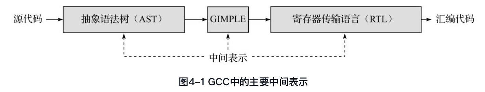
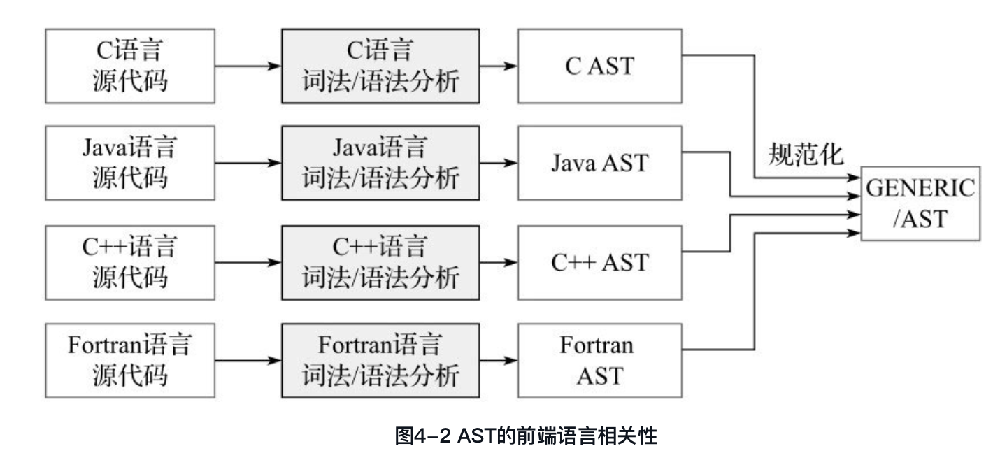
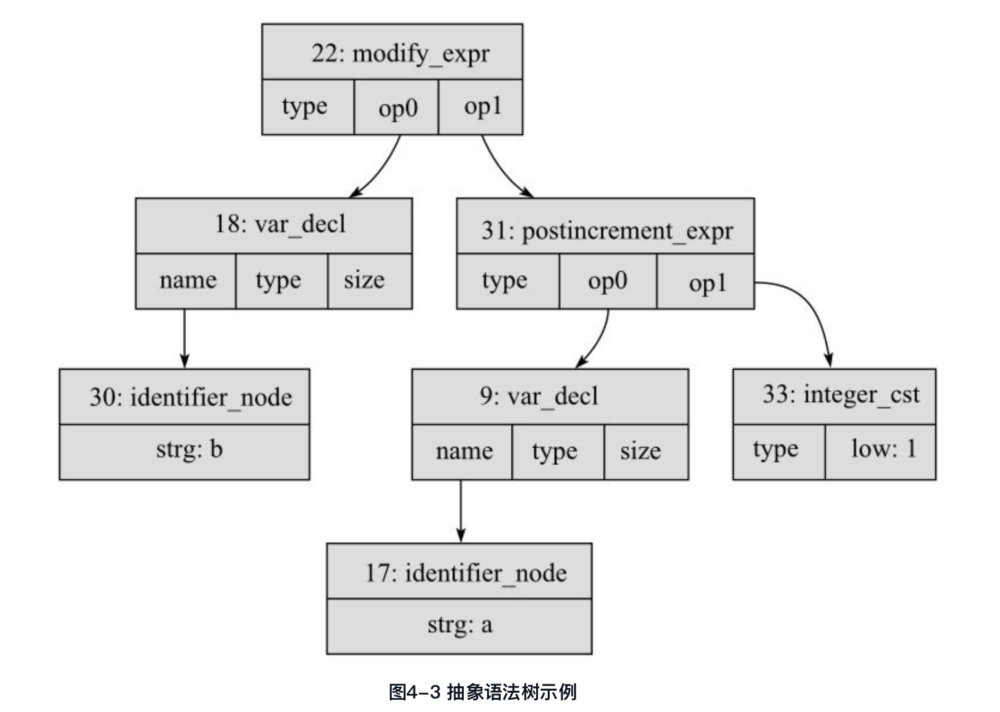

如图4-1所示，GCC在将高级程序源代码转换成目标机器汇编代码的过程中，主要使用了三种中间表示形式，即抽象语法树（Abstract Syntax Tree, AST）、GIMPLE及寄存器传输语言（Register Transfer Language, RTL）。本书就紧紧围绕这三种中间表示的基本概念、表示方法、存储结构及其生成技术等展开。

##4.1 抽象语法树
抽象语法树是编译系统中最常见的一种树形的中间表示形式，用来对前端语言的源代码进行规范的抽象表示。不同的高级程序设计语言通过其相应的词法/语法分析过程，会得到不同形式的抽象语法树，这些抽象语法树与编程语言的特征紧密相关，一般都包含了部分语言相关的AST节点表示。

GENERIC是指规范的AST。一般来说，如果一种前端语言的AST均可以使用gcc/tree. h中所表示的树节点表示，那么该AST就是规范的AST，即GENERIC形式。可以看出，GENERIC是一种规范的AST表示，引入GENERIC的目的就是力求寻找一种与前端语言无关的AST统一表示，便于对各种语言的AST进行一种通用的处理而已。

图4-3中给出了GCC中描述C语言语句“b=a++; ”的AST结构及其主要节点信息。
