如图4-1所示，GCC在将高级程序源代码转换成目标机器汇编代码的过程中，主要使用了三种中间表示形式，即抽象语法树（Abstract Syntax Tree, AST）、GIMPLE及寄存器传输语言（Register Transfer Language, RTL）。本书就紧紧围绕这三种中间表示的基本概念、表示方法、存储结构及其生成技术等展开。

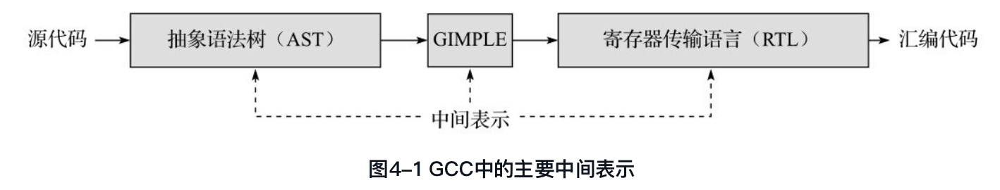

##4.1 抽象语法树
抽象语法树是编译系统中最常见的一种树形的中间表示形式，用来对前端语言的源代码进行规范的抽象表示。不同的高级程序设计语言通过其相应的词法/语法分析过程，会得到不同形式的抽象语法树，这些抽象语法树与编程语言的特征紧密相关，一般都包含了部分语言相关的AST节点表示。
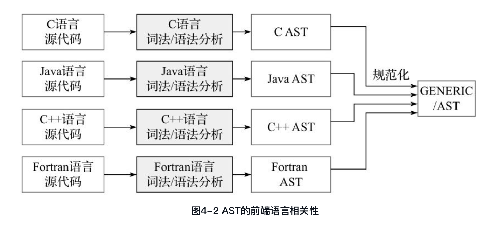

GENERIC是指规范的AST。一般来说，如果一种前端语言的AST均可以使用gcc/tree. h中所表示的树节点表示，那么该AST就是规范的AST，即GENERIC形式。可以看出，GENERIC是一种规范的AST表示，引入GENERIC的目的就是力求寻找一种与前端语言无关的AST统一表示，便于对各种语言的AST进行一种通用的处理而已。

图4-3中给出了GCC中描述C语言语句“b=a++; ”的AST结构及其主要节点信息。
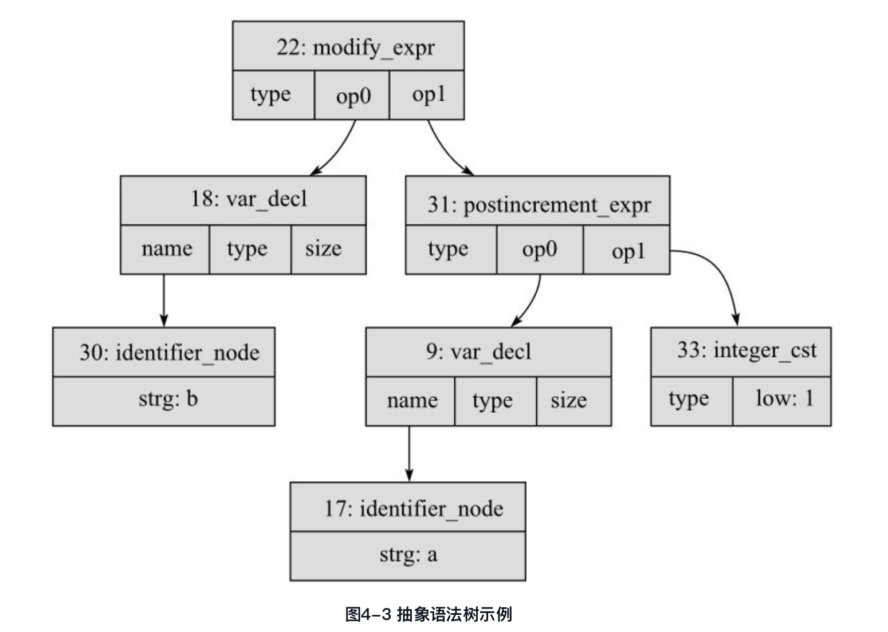

##4.2 树节点的声明

（1）标识（TREE_CODE）:DEFTREECODE宏定义中的SYM参数，描述了该节点代表的是一个什么样的节点，可以看作该树节点的语义描述。

> DEFTREECODE (PLUS_EXPR, "plus_expr", tcc_binary, 2)

该树节点的TREE_CODE为PLUS_EXPR，用来表示一个加法操作语义的树节点；

（2）名称（NAME）:DEFTREECODE宏定义中的NAME参数，表示该树节点的名称，使用字符串来描述，主要用来进行AST中间结果的显示，方便用户直观地了解该树节点的信息。

（3）类型（TREE_CODE CLASS, TCC）:DEFTREECODE宏定义中的TYPE参数，描述了该树节点的TREE_CODE所属的类型。例如，对于代表加法、减法和乘法运算的树节点，其分别声明如下：

> /* Simple arithmetic.  */
> DEFTREECODE (PLUS_EXPR, "plus_expr", tcc_binary, 2)
> DEFTREECODE (MINUS_EXPR, "minus_expr", tcc_binary, 2)
> DEFTREECODE (MULT_EXPR, "mult_expr", tcc_binary, 2)

而从语义类型上来说，这些运算树节点都属于同一个类型，即双目运算(tcc_binary)。

（4）长度：DEFTREECODE宏定义中的LEN参数，用来描述该树节点所包含的操作数的数目。


####关于类型的名称也在gcc/tree.c中给出了相关的定义。
```cpp
/* Tree code classes.  */

/* Each tree_code has an associated code class represented by a
   TREE_CODE_CLASS.  */

enum tree_code_class {
  tcc_exceptional, /* An exceptional code (fits no category).  */
  tcc_constant,    /* A constant.  */
  /* Order of tcc_type and tcc_declaration is important.  */
  tcc_type,        /* A type object code.  */
  tcc_declaration, /* A declaration (also serving as variable refs).  */
  tcc_reference,   /* A reference to storage.  */
  tcc_comparison,  /* A comparison expression.  */
  tcc_unary,       /* A unary arithmetic expression.  */
  tcc_binary,      /* A binary arithmetic expression.  */
  tcc_statement,   /* A statement expression, which have side effects
              but usually no interesting value.  */
  tcc_vl_exp,      /* A function call or other expression with a
              variable-length operand vector.  */
  tcc_expression   /* Any other expression.  */
};
```

通过上面的介绍可以看出，GCC中对一个树节点的声明主要包括4个方面，即标识、名称、类型及操作数个数等，并采用专门的数据结构进行相关内容的存储，如表4-1所示。
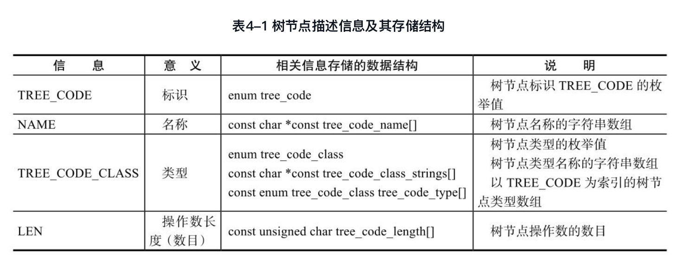

##4.3 树节点结构
所有树节点的存储都使用union类型，即联合体。在gcc/tree.h中定义的union tree_node的联合体如下：

```cpp
/* Define the overall contents of a tree node.
   It may be any of the structures declared above
   for various types of node.  */

union tree_node GTY ((ptr_alias (union lang_tree_node),
              desc ("tree_node_structure (&%h)")))
{
  struct tree_base GTY ((tag ("TS_BASE"))) base;
  struct tree_common GTY ((tag ("TS_COMMON"))) common;
  struct tree_int_cst GTY ((tag ("TS_INT_CST"))) int_cst;
  struct tree_real_cst GTY ((tag ("TS_REAL_CST"))) real_cst;
  struct tree_fixed_cst GTY ((tag ("TS_FIXED_CST"))) fixed_cst;
  struct tree_vector GTY ((tag ("TS_VECTOR"))) vector;
  struct tree_string GTY ((tag ("TS_STRING"))) string;
  struct tree_complex GTY ((tag ("TS_COMPLEX"))) complex;
  struct tree_identifier GTY ((tag ("TS_IDENTIFIER"))) identifier;
  struct tree_decl_minimal GTY((tag ("TS_DECL_MINIMAL"))) decl_minimal;
  struct tree_decl_common GTY ((tag ("TS_DECL_COMMON"))) decl_common;
  struct tree_decl_with_rtl GTY ((tag ("TS_DECL_WRTL"))) decl_with_rtl;
  struct tree_decl_non_common  GTY ((tag ("TS_DECL_NON_COMMON"))) decl_non_common;
  struct tree_parm_decl  GTY  ((tag ("TS_PARM_DECL"))) parm_decl;
  struct tree_decl_with_vis GTY ((tag ("TS_DECL_WITH_VIS"))) decl_with_vis;
  struct tree_var_decl GTY ((tag ("TS_VAR_DECL"))) var_decl;
  struct tree_field_decl GTY ((tag ("TS_FIELD_DECL"))) field_decl;
  struct tree_label_decl GTY ((tag ("TS_LABEL_DECL"))) label_decl;
  struct tree_result_decl GTY ((tag ("TS_RESULT_DECL"))) result_decl;
  struct tree_const_decl GTY ((tag ("TS_CONST_DECL"))) const_decl;
  struct tree_type_decl GTY ((tag ("TS_TYPE_DECL"))) type_decl;
  struct tree_function_decl GTY ((tag ("TS_FUNCTION_DECL"))) function_decl;
  struct tree_type GTY ((tag ("TS_TYPE"))) type;
  struct tree_list GTY ((tag ("TS_LIST"))) list;
  struct tree_vec GTY ((tag ("TS_VEC"))) vec; 
  struct tree_exp GTY ((tag ("TS_EXP"))) exp; 
  struct tree_ssa_name GTY ((tag ("TS_SSA_NAME"))) ssa_name;
  struct tree_block GTY ((tag ("TS_BLOCK"))) block;
  struct tree_binfo GTY ((tag ("TS_BINFO"))) binfo;
  struct tree_statement_list GTY ((tag ("TS_STATEMENT_LIST"))) stmt_list;
  struct tree_constructor GTY ((tag ("TS_CONSTRUCTOR"))) constructor;
  struct tree_memory_tag GTY ((tag ("TS_MEMORY_TAG"))) mtag;
  struct tree_omp_clause GTY ((tag ("TS_OMP_CLAUSE"))) omp_clause;
  struct tree_memory_partition_tag GTY ((tag ("TS_MEMORY_PARTITION_TAG"))) mpt; 
  struct tree_optimization_option GTY ((tag ("TS_OPTIMIZATION"))) optimization;
  struct tree_target_option GTY ((tag ("TS_TARGET_OPTION"))) target_option;
};
```

表4-2给出了这些不同的结构体所存储树节点的基本描述，union tree_node就是这些所有的存储结构体的一个泛称。
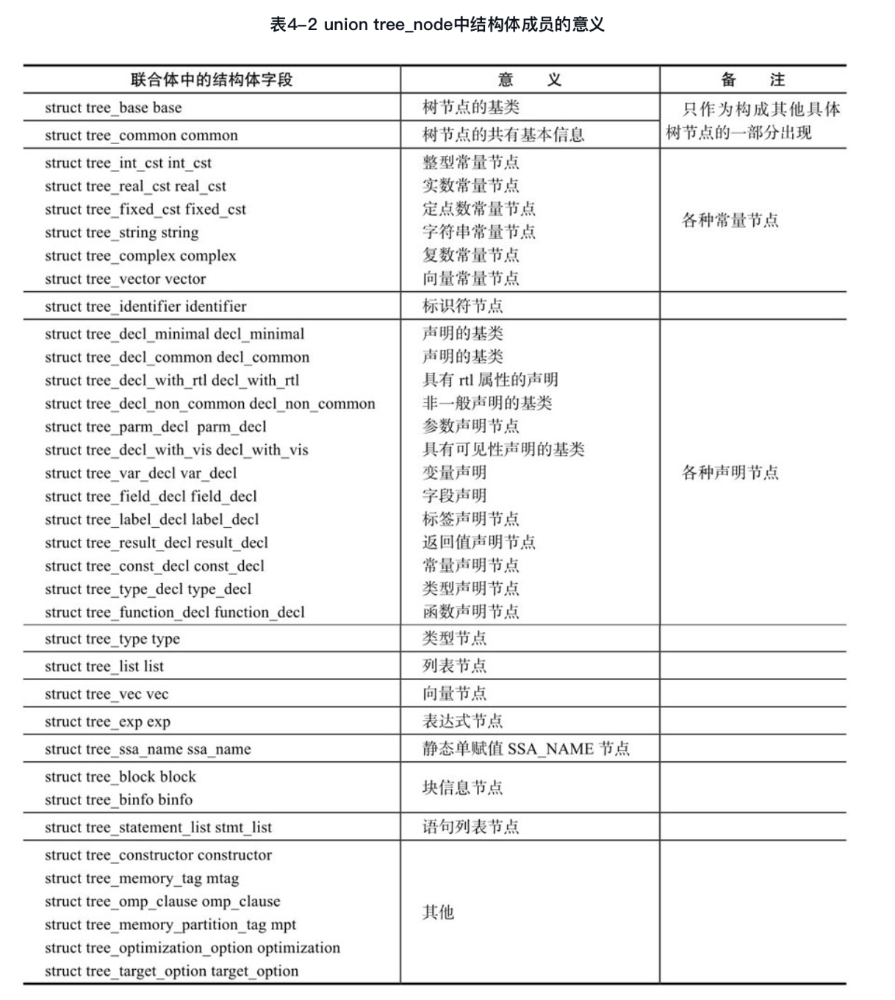

###4.3.3 常量节点

```cpp
             struct tree_int_cst
             {
               struct tree_common common;
               double_int int_cst;
             };

             typedef struct
             {
               unsigned HOST_WIDE_INT low;
               HOST_WIDE_INT high;
             } double_int;
```
struct tree_int_cst与struct tree_common及struct tree_base之间的“继承关系”如图4-5所示。也就是说，structtree_int_cst结构体中包含了一个struct tree_common结构体成员变量，而struct tree_common结构体中则包含了一个struct tree_base结构体成员变量。其他的常量树节点也具有类似的特性。

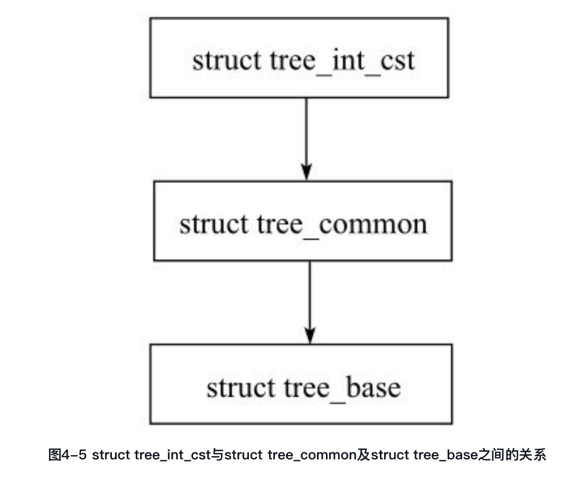

###4.3.5 声明节点
在GCC中，表示声明的树节点类型很多，例如变量声明节点、函数声明节点、参数声明节点、返回值声明节点等。同样，用来存储这些声明节点的结构体也有多种，可以使用下述命令查看：

```
             [GCC@localhost gcc-4.4.0]$  grep ^DEFTREESTRUCT gcc/treestruct.def  | grep _DECL
             DEFTREESTRUCT(TS_DECL_MINIMAL, "decl minimal")
             DEFTREESTRUCT(TS_DECL_COMMON, "decl common")
             DEFTREESTRUCT(TS_DECL_WRTL, "decl with RTL")
             DEFTREESTRUCT(TS_DECL_NON_COMMON, "decl non-common")
             DEFTREESTRUCT(TS_DECL_WITH_VIS, "decl with visibility")
             DEFTREESTRUCT(TS_FIELD_DECL, "field decl")
             DEFTREESTRUCT(TS_VAR_DECL, "var decl")
             DEFTREESTRUCT(TS_PARM_DECL, "parm decl")
             DEFTREESTRUCT(TS_LABEL_DECL, "label decl")
             DEFTREESTRUCT(TS_RESULT_DECL, "result decl")
             DEFTREESTRUCT(TS_CONST_DECL, "const decl")
             DEFTREESTRUCT(TS_TYPE_DECL, "label decl")
             DEFTREESTRUCT(TS_FUNCTION_DECL, "function decl")
```
以上这13种与声明有关的存储结构之间并不是完全独立的，而是具有一定的“继承”关系，图4-6给出了这些声明节点存储结构之间的关系。在该图中，如果存在A→B的关系，那么在A结构体中就包含了一个类型为B的结构体成员变量。例如struct tree_decl_common中就包含了一个成员变量struct tree_decl_minimal。
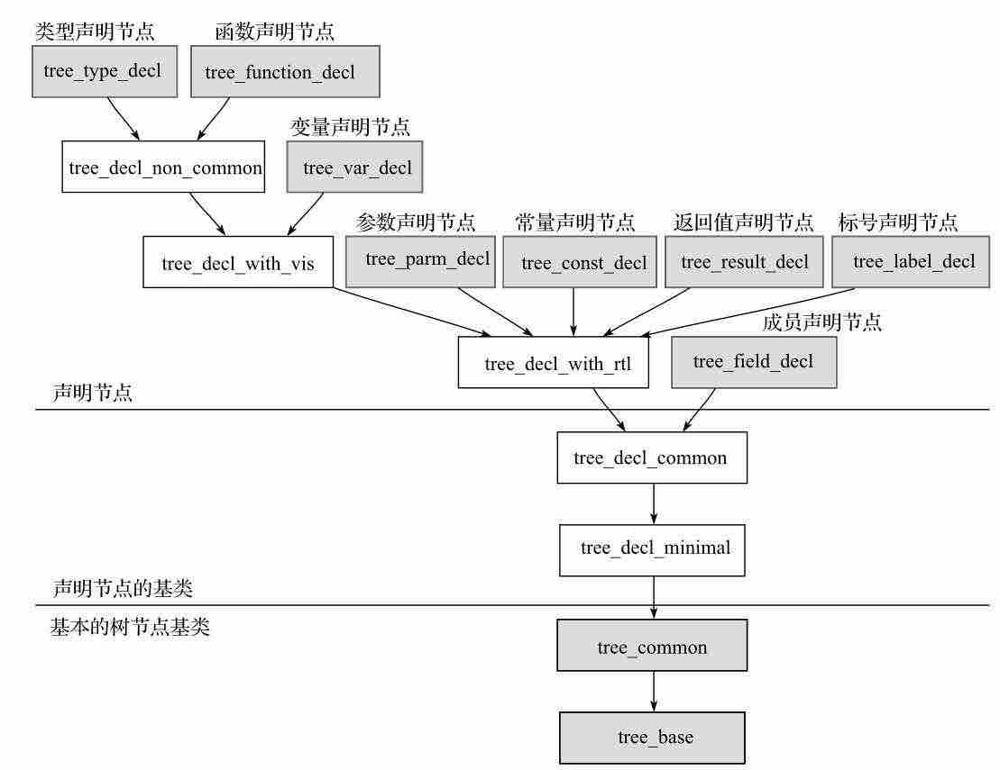

从图4-6可以看出，struct tree_decl_minimal及struct tree_decl_common是所有表示声明的结构体的基础，其他所有表示声明的结构体中都包含了该结构体成员。各种不同的声明结构体用来描述不同的声明，例如，变量声明使用struct tree_var_decl结构体存储，函数声明则使用struct tree_function_decl结构体存储。表4-3给出了常见的声明节点及其TREE_CODE、存储结构的对应关系。
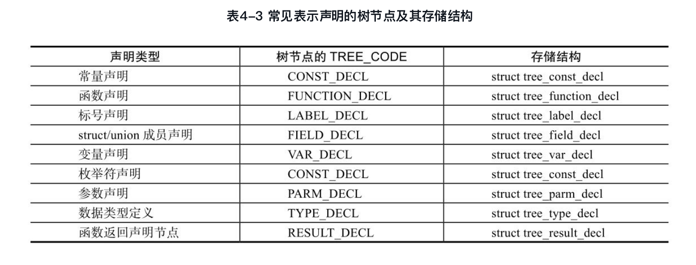

###4.3.7 struct tree_decl_common
在struct tree_decl_minimal中，描述了声明的基本信息：locus = 78, uid = 1230, name =0xb7d66930，分别表示该声明在源文件中的位置locus、该声明的uid，以及该声明对应的字符串名称。可以通过gdb获取该声明所在源代码的文件名称及其行号：

```
(gdb) print (expand_location (78)).file          /*打印文件名称*/
$15 = 0xbffff544 "test_cst.c"
(gdb) print (expand_location (78)).line          /*打印行号*/
$16 = 1
```
###4.3.8 struct tree_field_decl
该结构体常用来存储用户定义的结构体成员变量的声明，其定义如下：

```
 struct tree_field_decl
 {
   struct tree_decl_common common;
   tree offset;                      /*字段偏移量*/
   tree bit_field_type;              /*字段类型*/
   tree qualifier;                   /*字段修饰符*/
   tree bit_offset;                  /*字段的位偏移量*/
   tree fcontext;                    /*字段所在的结构体或联合体节点*/
 };
```
下面使用一个例子来说明。例4-9 struct tree_field_decl实例分析

```c
int field(){
struct student{
  char gender;
  short age;
  char name[20];
}tom;

  tom.gender = 'F';
  tom.age = 18;
  strcpy(tom.name, "TOM");
  return 0;
}
```

综上，三个成员变量节点的主要信息如表4-4所示。
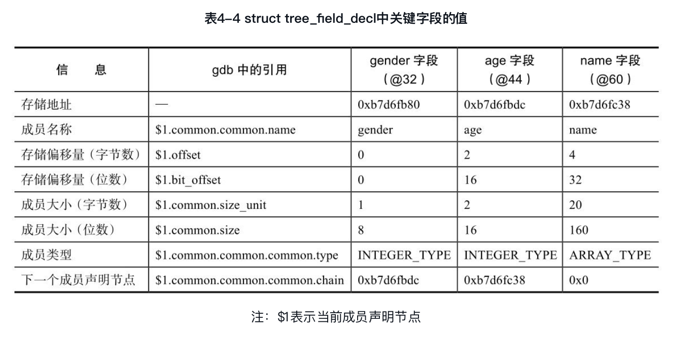

另外，也可以将gender声明节点的关键信息转换成如图4-7所示的关系图，其中size字段就是表4-4中的成员大小（位数）, bpos即表4-4中存储偏移量（位数），均由一个整数常量节点来表示，name字段指向该声明的标识符节点，type指向该成员变量的类型节点，chan字段指向下一个成员变量声明节点，scpe字段指向该成员变量所在的结构体类型节点。可以看出在struct student中，gender成员变量的位数为8位，而存储的偏移量为0位，该字段的名称为“gender”。
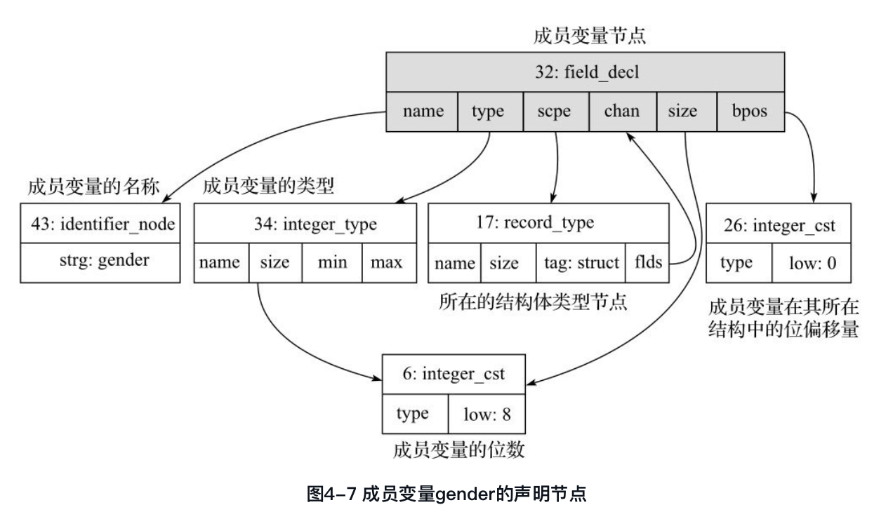
##4.4 AST输出及图示
###4.4.1 
GCC提供了-fdump-tree-original、-fdump-tree-all等选项，可以输出GCC处理源代码过程中的AST及GIMPLE中间表示信息。例如使用-fudmp-tree-original就可以输出GCC进行词法/语法解析后所生成的AST信息，然而该AST信息过于繁杂，不便分析，因此，本节通过在GCC源代码中增加一些调试语句，从而输出AST信息。

在gcc/gimplify.c的gimplify_function_tree函数中添加如下语句，主要调用dump_node函数打印当前函数的AST节点，此时打印的节点信息是在AST转换为GIMPLE之前的内容。

```cpp
/* Entry point to the gimplification pass.  FNDECL is the FUNCTION_DECL
   node for the function we want to gimplify.

   Returns the sequence of GIMPLE statements corresponding to the body
   of FNDECL.  */

void
gimplify_function_tree (tree fndecl)
{
  tree oldfn, parm, ret;
  gimple_seq seq;
  gimple bind;

  //B_chenhui
  FILE *fp;
  char filename[128];
  sprintf(filename, "AST-%s", current_function_name());
  fp = fopen(filename, "w");
  //dump_node(fndecl, 0x1FFF8, fp);
  //0x1FFF8不会打印addr，改成0x1FFF9
  dump_node(fndecl, 0x1FFF9, fp);
  fclose(fp);
  //E_chenhui
  oldfn = current_function_decl;
  current_function_decl = fndecl;
  ...
  ...
}
```

编译该GCC源代码，并使用编译出来的cc1来编译下面例子中的源代码，从而生成其中各个函数对应的AST信息，例如函数func对应的AST信息文件名称为AST-func, main函数对应的AST信息文件名称为AST-main等。

###4.4.2
假设有如下的源代码：

```cpp
int main(int argc, char *argv[])
{
    int i = 0;
    int sum = 0;
    for (i = 0;  i < 10; i++)
    {
        sum = sum + i;
    }
    return sum;
}
```

编译该源代码：
>   cc1 test.c
 
 该源代码中函数main对应的AST文件名称为AST-main，查看该文件。(有点失败，没有生成address相关的信息，后面看看怎么生成？)
 
 ```
@1      function_decl    name: @2       type: @3       srcp: test.c:1      
                         args: @4       link: extern   body: @5      
                         addr: 7fe466baec00 
@2      identifier_node  strg: main     lngt: 4        addr: 7fe466ba8ae0 
@3      function_type    size: @6       algn: 8        retn: @7      
                         prms: @8       addr: 7fe466baf540 
@4      parm_decl        name: @9       type: @7       scpe: @1      
                         srcp: test.c:1                chan: @10     
                         argt: @7       size: @11      algn: 32      
                         used: 0        addr: 7fe466c96480 
@5      bind_expr        type: @12      vars: @13      body: @14     
                         addr: 7fe466c95730 
@6      integer_cst      type: @15      low : 8        addr: 7fe466c8d7b0 
@7      integer_type     name: @16      size: @11      algn: 32      
                         prec: 32       sign: signed   min : @17     
                         max : @18      addr: 7fe466c9d540 
@8      tree_list        valu: @7       chan: @19      addr: 7fe466bc32a0 
@9      identifier_node  strg: argc     lngt: 4        addr: 7fe466bb5f60 
@10     parm_decl        name: @20      type: @21      scpe: @1      
                         srcp: test.c:1                argt: @21     
                         size: @22      algn: 64       used: 0       
                         addr: 7fe466c96510 
@11     integer_cst      type: @15      low : 32       addr: 7fe466c8da50 
@12     void_type        name: @23      algn: 8        addr: 7fe466cac3c0 
@13     var_decl         name: @24      type: @7       scpe: @1      
                         srcp: test.c:3                chan: @25     
                         init: @26      size: @11      algn: 32      
                         used: 1        addr: 7fe466d636e0 
@14     statement_list   0   : @27      1   : @28      2   : @29     
                         3   : @30      4   : @31      5   : @32     
                         6   : @33      7   : @34      8   : @35     
                         9   : @36      10  : @37      addr: 7fe466bc3360 
@15     integer_type     name: @38      size: @22      algn: 64      
                         prec: 64       sign: unsigned min : @39     
                         max : @40      addr: 7fe466c9d0c0 
@16     type_decl        name: @41      type: @7       srcp: <built-in>:0      
                         addr: 7fe466c9dc00 
@17     integer_cst      type: @7       high: -1       low : -2147483648 
                         addr: 7fe466c8d9c0 
@18     integer_cst      type: @7       low : 2147483647  addr: 7fe466c8d9f0 
@19     tree_list        valu: @21      chan: @42      addr: 7fe466bc3270 
@20     identifier_node  strg: argv     lngt: 4        addr: 7fe466bc4000 
@21     pointer_type     size: @22      algn: 64       ptd : @43     
                         addr: 7fe466baf480 
@22     integer_cst      type: @15      low : 64       addr: 7fe466c8db40 
@23     type_decl        name: @44      type: @12      srcp: <built-in>:0      
                         addr: 7fe466cb5000 
@24     identifier_node  strg: i        lngt: 1        addr: 7fe466bc4060 
@25     var_decl         name: @45      type: @7       scpe: @1      
                         srcp: test.c:4                init: @26     
                         size: @11      algn: 32       used: 1       
                         addr: 7fe466d63780 
@26     integer_cst      type: @7       low : 0        addr: 7fe466caa4e0 
@27     decl_expr        type: @12      addr: 7fe46cc511c0 
@28     decl_expr        type: @12      addr: 7fe46cc51200 
@29     modify_expr      type: @7       op 0: @13      op 1: @26     
                         addr: 7fe46cc51240 
@30     goto_expr        type: @12      labl: @46      addr: 7fe46cc51440 
@31     label_expr       type: @12      name: @47      addr: 7fe46cc51380 
@32     modify_expr      type: @7       op 0: @25      op 1: @48     
                         addr: 7fe46cc51340 
@33     postincrement_expr type: @7       op 0: @13      op 1: @49     
                         addr: 7fe46cc512c0 
@34     label_expr       type: @12      name: @46      addr: 7fe46cc51400 
@35     cond_expr        type: @12      op 0: @50      op 1: @51     
                         op 2: @52      addr: 7fe466c956e0 
@36     label_expr       type: @12      name: @53      addr: 7fe46cc514c0 
@37     return_expr      type: @12      expr: @54      addr: 7fe46cc51540 
@38     identifier_node  strg: bit_size_type           lngt: 13      
                         addr: 7fe466c9cd80 
@39     integer_cst      type: @15      low : 0        addr: 7fe466caa390 
@40     integer_cst      type: @15      low : -1       addr: 7fe466caa330 
@41     identifier_node  strg: int      lngt: 3        addr: 7fe466c9c1e0 
@42     tree_list        valu: @12      addr: 7fe466caa9c0 
@43     pointer_type     size: @22      algn: 64       ptd : @55     
                         addr: 7fe466cb2600 
@44     identifier_node  strg: void     lngt: 4        addr: 7fe466c9c720 
@45     identifier_node  strg: sum      lngt: 3        addr: 7fe466bc40c0 
@46     label_decl       type: @12      scpe: @1       srcp: test.c:8      
                         note: artificial              addr: 7fe466bc5100 
@47     label_decl       type: @12      scpe: @1       srcp: test.c:8      
                         note: artificial              addr: 7fe466bc5080 
@48     plus_expr        type: @7       op 0: @25      op 1: @13     
                         addr: 7fe46cc51300 
@49     integer_cst      type: @7       low : 1        addr: 7fe466caa510 
@50     le_expr          type: @7       op 0: @13      op 1: @56     
                         addr: 7fe46cc51280 
@51     goto_expr        type: @12      labl: @47      addr: 7fe46cc513c0 
@52     goto_expr        type: @12      labl: @53      addr: 7fe46cc51480 
@53     label_decl       type: @12      scpe: @1       srcp: test.c:8      
                         note: artificial              addr: 7fe466bc5180 
@54     modify_expr      type: @7       op 0: @57      op 1: @25     
                         addr: 7fe46cc51500 
@55     integer_type     name: @58      size: @6       algn: 8       
                         prec: 8        sign: signed   min : @59     
                         max : @60      addr: 7fe466c9d300 
@56     integer_cst      type: @7       low : 9        addr: 7fe466bc3450 
@57     result_decl      type: @7       scpe: @1       srcp: test.c:2      
                         note: artificial              size: @11     
                         algn: 32       addr: 7fe466bc5000 
@58     type_decl        name: @61      type: @55      srcp: <built-in>:0      
                         addr: 7fe466c9dcc0 
@59     integer_cst      type: @55      high: -1       low : -128    
                         addr: 7fe466c8d750 
@60     integer_cst      type: @55      low : 127      addr: 7fe466c8d8a0 
@61     identifier_node  strg: char     lngt: 4        addr: 7fe466c9bd20 

 ```
 
###4.4.3
```bash
(gdb) bt
#0  dump_node (t=0x7ffff1b2b000, flags=131064, stream=0xf89ba0) at ../.././gcc/tree-dump.c:740
#1  0x000000000056176d in gimplify_function_tree (fndecl=0x7ffff1b2b000) at ../.././gcc/gimplify.c:7465
#2  0x000000000045d738 in c_genericize (fndecl=0x7ffff1b2b000) at ../.././gcc/c-gimplify.c:107
#3  0x000000000040ed70 in finish_function () at ../.././gcc/c-decl.c:6823
#4  0x0000000000459d12 in c_parser_declaration_or_fndef (parser=0x7ffff7b5a140, fndef_ok=<value optimized out>, empty_ok=<value optimized out>, nested=0 '\000',
    start_attr_ok=<value optimized out>) at ../.././gcc/c-parser.c:1319
#5  0x000000000045c698 in c_parser_translation_unit () at ../.././gcc/c-parser.c:979
#6  c_parse_file () at ../.././gcc/c-parser.c:8314
#7  0x0000000000445375 in c_common_parse_file (set_yydebug=<value optimized out>) at ../.././gcc/c-opts.c:1252
#8  0x000000000064e254 in compile_file (argc=<value optimized out>, argv=<value optimized out>) at ../.././gcc/toplev.c:970
#9  do_compile (argc=<value optimized out>, argv=<value optimized out>) at ../.././gcc/toplev.c:2197
#10 toplev_main (argc=<value optimized out>, argv=<value optimized out>) at ../.././gcc/toplev.c:2229
#11 0x000000318ae1ecdd in __libc_start_main () from /lib64/libc.so.6
#12 0x00000000004043d9 in _start ()
```

###4.4.4
为了对上述的AST信息进行有效分析，尤其是各个AST节点之间的相互关系，可以使用http://www.graphviz.org提供的图形可视化工具Graphviz（Graph Visualization Software）对上述的AST信息进行图示，从而直观地进行AST分析。在进行图示前，需要对上述的AST信息进行处理，分析节点之间的关系，并转换成绘图脚本，最后调用graphviz提供的绘图工具绘制出这些节点之间的关系，例如本书中所有的AST节点图以及函数调用关系图等均是采用graphviz中的dot工具绘制。下面给出使用shell工具对AST信息进行提取，并进行图形绘制的shell脚本。其主要包括以下几个步骤：
####（1）pre.awk：使用awk脚本对AST文件信息进行预处理。
```bash
[GCC@localhost ast-node]$ cat pre.awk
        #! /usr/bin/gawk -f
            /^[^; ]/{
                gsub(/^@/, "～@", $0);
                gsub(/( *):( *)/, ":", $0);
                print;
            }
```
####（2）treeviz.awk：使用awk脚本将预处理后的AST信息转换成图形脚本。
```bash
  [GCC@localhost ast-node]$ cat treeviz.awk
        #! /usr/bin/gawk -f
        #http://alohakun.blog7.fc2.com/? mode=m&no=355
        BEGIN {RS = "～@"; printf "digraph G {\n node [shape = record]; \n"; }

        /^[0-9]/{
            s = sprintf("%s [label = \"{%s: %s | {", $1, $1, $2);
            for(i = 3; i < NF; i++)
                s = s sprintf("%s | ", $i);
            s = s sprintf("%s}}\"]; \n", $i);
            $0 = s;
            while (/([0-9a-zA-Z]+):@([0-9]+)/){
                format = sprintf("<\\1>\\1 \\3\n %s:\\1 -> \\2; ", $1);
                $0 = gensub(/([0-9a-zA-Z]+):@([0-9]+)(.*)$/, format, "g");
            };
            printf " %s\n", $0;
        }
        END {print "}"}
```
####（3）ast_to_dot.sh：调用上述两个awk处理脚本，并最终调用dot等绘图工具生成AST图形。
```bash
  [GCC@localhost ast-node]$ cat ast_to_dot.sh
    #/bin/bash
    # $1 为AST文件名称
    # $2 可以是字符串“all”表示图示AST中的所有节点
    # $2, $3, $4, …也可以是一系列的AST节点编号，则该脚本只图示指定编号的AST节点
    # 例如：
    # ./ast_to_dot.sh AST_file all 表示图示所有节点及其相关关系
    # ./ast_to_dot.sh AST_file 1 4 5 8 表示图示AST文件中编号为1、4、5、8等几个节点的信息及其关系

    # 获取AST文件名称
    f=$1

    # 对AST文件中一些特殊字段进行处理，将不必要的空格去掉
    sed -i "s/op\ 1/op1/g" $f
    sed -i "s/op\ 2/op2/g" $f
    sed -i "s/op\ 0/op0/g" $f

    #  对AST文件进行预处理，为了清晰起见，可以将一些“次要的”信息删除，减少图形中的信息，用户可以
根据需要修改
    ./pre.awk  $f  |  sed  's/srcp:[a-z_.:0-9<>-]*//  g'  |  sed  's/note:[a-z]*//  g'  |
sed 's/link:[a-z]*// g' |   sed 's/used:[0-9]*// g' | sed 's/algn:[0-9]*// g' |sed
's/prec:[0-9]*// g' |   sed 's/lngt:[0-9]*// g' | sed 's/sign:[a-z]*// g' > tmp1

    # 对简化后的AST文件进行转换，生成图形脚本文件$f.dot
    ./treeviz.awk tmp1 > $f.dot

    # 创建临时文件
    rm -f tmp; touch tmp

    #  如果$2表示全部转换，则直接使用上述转换后的dot脚本，否则，从上述生成的dot脚本中筛选相应的
节点，加入到tmp文件中
    if [ $2 ! = "all" ]
    then
       echo "digraph G {" >> tmp
       echo " node [shape = record]; " >> tmp
# 筛选给定的节点
       for n in $*
       do
            grep " $n " $f.dot >> tmp
            grep " $n:" $f.dot >> tmp_header
       done

       rm -rf tmp_header_tail
       for n in $*
       do
            grep " $n; " tmp_header >> tmp_header_tail
       done
    # 去除冗余的节点信息
       sort tmp_header_tail | uniq   >> tmp
       echo " }" >> tmp
    # 否则图示所有节点
    else
       cat $f.dot > tmp
    fi

    #调用graphviz中的dot工具绘图，节点字体大小为10point，输出文件格式为svg矢量图形格式，输
出文件名称为$f.svg
    dot -Nfontsize=10 -Tsvg tmp -o $f.svg
```


ast_to_dot.sh脚本有两种典型的执行方式：
（1）对AST文件中的所有内容进行处理并绘图，生成的图形文件名称为AST_FILE.svg。

        [GCC@localhost test]$ ./ast_to_dot AST_FILE all
（2）对AST文件中的编号为@node_num1, @node_num2, …等节点的内容进行处理并绘图，生成的图形文件名称为$AST_FILE.svg。

        [GCC@localhost test]$ ./ast_to_dot AST_FILE node_num1, node_num2, …
在某些情况下，读者只关注某个节点及其相关节点之间的关系，而忽略其他节点的信息，此时可以使用如下的脚本，用来图示某个节点及其相关节点（一般只打印到其两层子节点），该脚本名称为print_node.sh，内容如下：

```bash
      [GCC@localhost ast-node]$ cat print_node.sh
        #/bin/bash
        # $1 AST文件名称
        # $2 节点编号
        # $3 打印方向，取值为LR|RL|BT，分别表示按从left-to-right, right-to-left, bottom-to-top的
    方向画图，省略则表示从top-to-bottom
        # 例如：./print_node.sh AST-FILE 5 LR 表示图示@5号节点及其相关联的节点，图示的方向为从左到右
        # 获取AST文件名称
        f=$1
        # 获取给定的节点编号
        node=$2
        # 获取绘图方向
        rank=$3

        #对AST文件中一些特殊字段进行处理，将不必要的空格去掉
        sed -i "s/op\ 1/op1/g" $f
        sed -i "s/op\ 2/op2/g" $f
        sed -i "s/op\ 0/op0/g" $f

        #对AST文件进行预处理，为了清晰起见，将一些“次要的”信息删除，减少图形中的信息
        ./pre.awk $f | sed 's/srcp:[a-z_.:0-9<>-]*// g' | sed 's/note:[a-z]*// g' > tmp1

        #将预处理后的文件进行dot脚本的转换
        ./treeviz.awk tmp1 > $f.dot

        rm -f tmp; touch tmp

        # 生成dot脚本的首部
              echo "digraph G {" >> tmp
              echo " node [shape = record]; " >> tmp

              rm -rf tmp_header
              # 筛选与node节点有关的关联关系
              grep " $node " $f.dot >> tmp
              grep " $node:" $f.dot >> tmp_header

              # 查找以node为起始节点的关联关系
              tail=`grep " $node:" $f.dot | awk '{print $3}' | sed 's/; // g'`

              # 将node关联的子节点信息加入到tmp文件中
              for n in $tail
              do
                grep " $n " $f.dot >> tmp
                grep " $n:" $f.dot >> tmp_header
              done

              [ -f tmp_header ] && sort tmp_header | uniq   >> tmp

              # 生成dot脚本的结束部分
              echo " }" >> tmp

              # 根据方向参数，调用graphviz中的dot工具绘图
              if [ -z $rank ]
              then
                dot -Nfontsize=10 -Tsvg tmp -o ${f}_${node}.svg
              else
                dot -Nfontsize=10 -Grankdir=${rank} -Tsvg tmp -o ${f}_${node}.svg
              fi
```
例如，如果执行下述命令：

          [GCC@localhost ast-node]$ ./print_node AST-main 1 LR
          
 就可以根据例4-18中的AST信息，将@1号节点及其关联的节点输出为图4-22所示的内容，其中的打印方向为从左向右（LR, Left-to-Right）。从中可以清晰地看出函数声明节点（@1号节点）与标识符节点（@2号节点）、函数类型节点（@3号节点）、参数声明节点（@4号节点）以及BIND_EXPR表达式节点（@5号节点）之间的关系。
 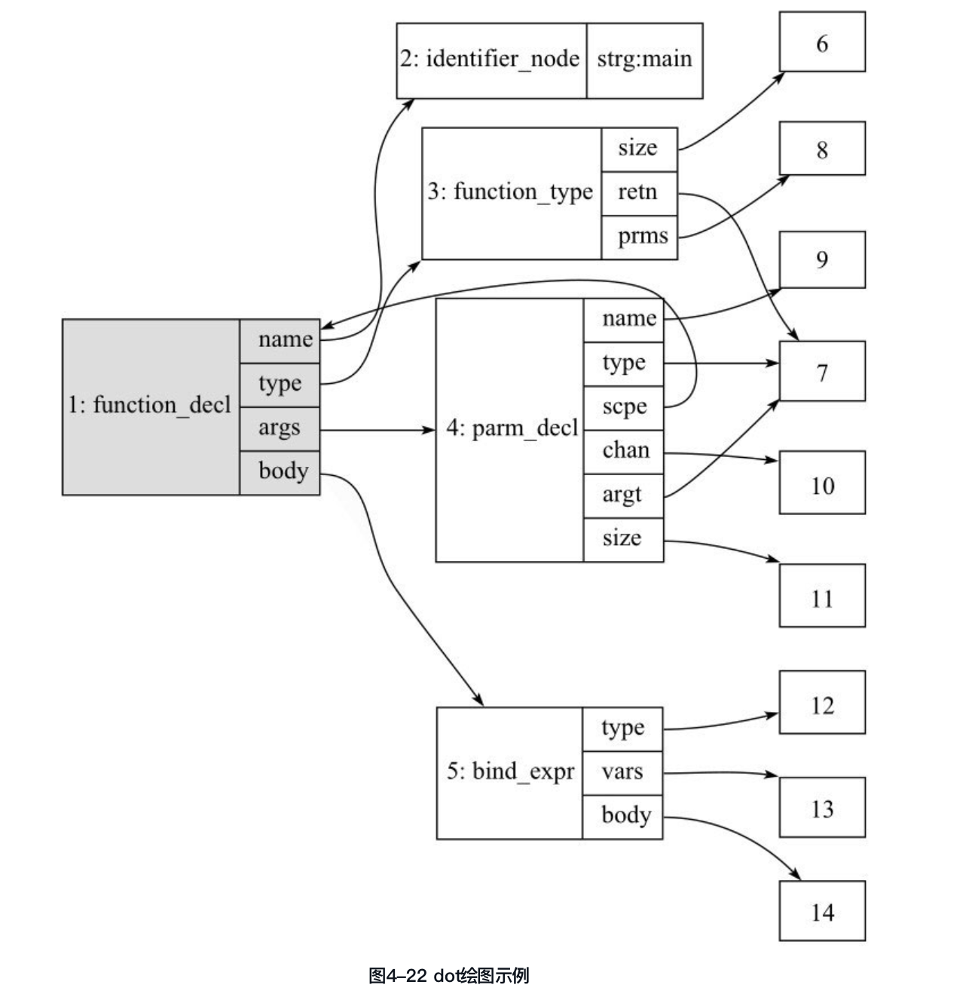
 
 通过使用上述的脚本，用户可以很方便地显示AST中的部分节点及其相互关系，或者某个节点所关联的其他节点，有了AST的图示，对于理解AST非常有帮助。
例4-19 图示AST中的部分信息
有了上述AST图示的脚本，就可以对例4-18中的AST进行图形化显示。例如，当读者对函数声明感兴趣时，可以使用：

          [GCC@localhost ast-node]$ ./print_node AST-main 1 LR
打印出该节点所关联的节点，如图4-22所示。
当读者对main函数中的BIND_EXPR节点感兴趣时，可以使用：

            [GCC@localhost ast-node]$ ./print node AST-main 5 LR
打印该信息，其中的5表示BIND_EXPR节点的节点编号，结果如图4-23所示。
在使用图示工具的时候，需要对需要图示的内容进行筛选，否则可能导致图形过大、关系过于复杂而大大影响节点关系的分析。例如，通常读者可以直接使用．/ast_to_dot.sh AST-main all将所有的节点及其关系绘制出来，但是当节点很多时，图中的节点和连接关系就非常复杂，反倒失去了图示的优势，所有，当AST中节点较少时，可以使用．/ast_to_dot.sh all打印完整的AST图，更多的情况是打印图中读者比较感兴趣的节点，此时可以通过给定．/ast_to_dot.sh传递合适的节点编号，也可以通过．/print_node.sh对指定的节点进行图示。

##4.5 AST的生成
###4.5.1 词法分析
词法分析就是把源代码中的字符流划分成词法符号（token）的过程，目前常用的词法分析工具为Lex/F lex等，关于词法分析的原理及相关工具的使用请查阅相关文献。本章以在GCC中使用struct c_token结构体来描述一个C语言中的词法符号。GCC中C语言的词法分析为例，说明GCC进行词法分析时使用的主要存储结构和分析的基本过程。
 
 ```cpp
/*A single C token after string literal concatenation and conversion of preprocessing
tokens to tokens.*/
                   typedef struct c_token GTY (())
                   {
                     ENUM_BITFIELD (cpp_ttype) type : 8;                 /*符号类型*/
                     ENUM_BITFIELD (c_id_kind) id_kind : 8;
                     /* 如果该符号类型是CPP_NAME，那么该字段描述该标识符的类型，否则为
                     C_ID_NONE. */
                     ENUM_BITFIELD (rid) keyword : 8;
                     /* 关键字值。如果该符号不是关键字，那么该字段值为RID_MAX. */
                     ENUM_BITFIELD (pragma_kind) pragma_kind : 8;
                     /* 编译制导符号的值，如果该符号不是编译制导符号，则为PRAGMA_NONE. */
                     tree value;                                         /*符号的值*/
                     location_t location;                                /*符号在源代码中的位置*/
                   } c_token;
 ```
 该结构体主要包括符号类型（type）、标识符类型（id_kind）、关键字标识（keyword）、PRAGMA类型（pragma_kind）、符号的值（value）以及描述该符号在源文件中的位置信息（location）。
  
#### 1．符号类型
 符号的类型主要包括了以下的内容（参见libcpp/include/cpplib.h），主要定义了一些操作符号（例如"="、"!"、">"等）、分隔符号（":"、", "、"; "、"{"、"}"、"["、"]"等），这些符号及其类型值由OP宏给出。符号类型还包括了一些由TK宏给出的类型，主要包括文件结束符号EOF、名字（NAME）、数值、各种类型的字符数值、各种字符串数值、注释（COMMENT）、头文件名称（HEADER_NAME）等。这些符号类型由如下的enumcpp_ttype所定义。
 
 经过预处理，enum cpp_ttype定义的符号类型如下：
 
 ```cpp
                  enum cpp_ttype
                 {
                   CPP_EQ,
                   CPP_NOT,
                   /* 限于篇幅，省略部分内容 */
                   CPP_ PADDING,
                   N_TTYPES,                 /*符号类型的数量*/
                   CPP_LAST_EQ          = CPP_LSHIFT,
                   CPP_FIRST_DIGRAPH    = CPP_HASH,
                   CPP_LAST_PUNCTUATOR= CPP_ATSIGN,
                   CPP_LAST_CPP_OP      = CPP_LESS_EQ
                 };
 ```
####2．标识符类型
 如果某个符号的类型为CPP_NAME，即表示该符号为一个标识符。GCC对CPP_NAME类型的符号进行了更详细的类型划分，在gcc/c-parser.c文件中定义的枚举类型enum c_id_kind描述了各种标识符的类型。[插图]
 
 ```cpp
              /*More information about the type of a CPP_NAME token.*/
             typedef enum c_id_kind {
               C_ID_ID,                  /*普通标识符*/
               C_ID_TYPENAME,            /*描述类型的标识符*/
               C_ID_CLASSNAME,           /*Object-C中的对象名称标识符*/
               C_ID_NONE                 /*不是一个标识符*/
             } c_id_kind;
 ```
 
 也就是说，CPP_NAME的类型包括普通标识符（C_ID_ID）、类型名称（C_ID_TYPENAME）、Objective-C中的对象名称（C_ID_CLASSNAME）及其他（C_ID_NONE）四种类型。
 
####3．关键字标识
当一个标识符表示编程语言中的关键字（Key Words）时，必须明确定义这些关键字的值，来唯一表示该关键字所代表的意义。在gcc/c-common.h中定义了C语言（包括C++、Objective-C等语言）中的所有关键字的枚举值，例如关键字“static”的值为RID_STATIC，关键字“int”的值为RID_INT等，这些关键字所对应的枚举值定义在enmu rid中。

```cpp
             enum rid
             {
               /* 限定符 */
               /*C, in empirical order of frequency.*/
               RID_STATIC = 0,
               RID_UNSIGNED, RID_LONG,     RID_CONST, RID_EXTERN,
               RID_REGISTER, RID_TYPEDEF, RID_SHORT, RID_INLINE,
               RID_VOLATILE, RID_SIGNED,   RID_AUTO,   RID_RESTRICT,

               /* C扩展 */
               RID_COMPLEX, RID_THREAD, RID_SAT,

               /* 省略部分与C无关的内容 */
               /* C */
               RID_INT,      RID_CHAR,    RID_FLOAT,      RID_DOUBLE, RID_VOID,
               RID_ENUM,     RID_STRUCT, RID_UNION,       RID_IF,      RID_ELSE,
               RID_WHILE,    RID_DO,      RID_FOR,        RID_SWITCH, RID_CASE,
               RID_DEFAULT, RID_BREAK,    RID_CONTINUE, RID_RETURN, RID_GOTO,
               RID_SIZEOF,

               /* C扩展 */
               RID_ASM,         RID_TYPEOF,    RID_ALIGNOF,   RID_ATTRIBUTE,   RID_VA_ARG,
               RID_EXTENSION, RID_IMAGPART, RID_REALPART, RID_LABEL, RID_CHOOSE_EXPR,
               RID_TYPES_COMPATIBLE_P,
               RID_DFLOAT32, RID_DFLOAT64, RID_DFLOAT128,
               RID_FRACT, RID_ACCUM,
               /* 省略部分与C无关的内容 */
               RID_MAX,

               RID_FIRST_MODIFIER = RID_STATIC,
         RID_LAST_MODIFIER = RID_ONEWAY,

         RID_FIRST_CXX0X = RID_STATIC_ASSERT,
         RID_LAST_CXX0X = RID_DECLTYPE,
         RID_FIRST_AT = RID_AT_ENCODE,
         RID_LAST_AT = RID_AT_IMPLEMENTATION,
         RID_FIRST_PQ = RID_IN,
         RID_LAST_PQ = RID_ONEWAY
       };
```
####4.PRAGMA类型（pragma_kind）
当一个符号为CPP_PRAGMA时，则表示该词法符号为编译制导标识，用来对编译进行制导。gcc/c-pragma.h中定义的enum pragma_kind描述了GCC所支持的各种不同编译制导符号的枚举值。

```cpp
             typedef enum pragma_kind {
               PRAGMA_NONE = 0,
               /* OpenMP相关的编译制导标识 */
               PRAGMA_OMP_ATOMIC,
               PRAGMA_OMP_BARRIER,
               PRAGMA_OMP_CRITICAL,
               PRAGMA_OMP_FLUSH,
               PRAGMA_OMP_FOR,
               PRAGMA_OMP_MASTER,
               PRAGMA_OMP_ORDERED,
               PRAGMA_OMP_PARALLEL,
               PRAGMA_OMP_PARALLEL_FOR,
               PRAGMA_OMP_PARALLEL_SECTIONS,
               PRAGMA_OMP_SECTION,
               PRAGMA_OMP_SECTIONS,
               PRAGMA_OMP_SINGLE,
               PRAGMA_OMP_TASK,
               PRAGMA_OMP_TASKWAIT,
               PRAGMA_OMP_THREADPRIVATE,
               PRAGMA_GCC_PCH_PREPROCESS,      /*预处理编译制导符号*/
               PRAGMA_FIRST_EXTERNAL
             } pragma_kind;
```

这些CPP_PRAGMA符号主要用于OMP语句的编译制导，另外一个常见的编译制导符号为PRAGMA_GCC_PCH_PREPROCESS，用来标识编译的预处理。

####5．树节点指针（value）
对于一些词法符号来讲，不仅需要关注其类型，还要关注其值。例如，字符串常量符号，其词法符号类型为CPP_STRING，而该字符串常量的值由value指向的字符串常量树节点给出。

####6．位置信息（location）
位置信息用来描述每个词法符号在源文件中出现的位置，帮助用户进行错误定位。在gcc/input.h中定义了location_t类型。

            typedef source_location location_t;
           
同时该文件中也提供了一些获取符号位置的结构体和方法。

```cpp
             typedef struct
             {
               const char *file;                  /*源文件名称*/
               int line;                          /*该符号所在源文件中的行号*/
               int column;                        /*该符号所在源文件中的列号*/
               bool sysp;                         /*是否在系统提供的头文件中*/
             } expanded_location;
             extern expanded_location expand_location (source_location);
             #define LOCATION_FILE(LOC) ((expand_location (LOC)).file)
             #define LOCATION_LINE(LOC) ((expand_location (LOC)).line)
```
利用上述两个宏定义，可以提取词法符号c_token的位置信息，包括所在源文件的文件名及文件中的行号，其中LOC的值指的是c_token.location字段的值。

###4.5.2 词法分析过程
###4.5.3 语法分析

上节介绍了GCC中词法分析的基本思路，并给出了一个实例。本节将进一步解释GCC中的语法分析。

语法分析要解决的主要问题是：对于词法分析得到的词法符号序列进行语法的推导，如果推导成功，则源代码就是一个满足语法规范的源代码。关于语法分析的原理可以参见编译原理中语法分析的章节，常用的语法分析工具包括Yacc、Bison等，有兴趣的读者可以自行参阅，本节不做讨论。早期的GCC中使用Yacc及Bison进行C语言的语法分析，而在较高的版本中，不再使用Yacc或Bison，而是使用gcc/c-parser.c中定义的专门函数完成C语言的语法分析。

在进行详细的语法分析之前，首先对C语言的语法进行简单描述。

C语言发展至今，其语法标准经历了多次修订，目前较为常用的包括C89/C90、C94/C95、C99及C11等标准，这些标准均已在GCC的代码中予以支持。表4-5给出的是GCC支持这些C语言标准的编译器选项。
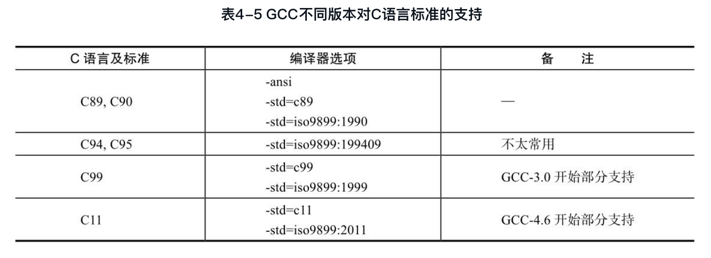

另外，GCC既支持各种不同的C语言语法标准，同时也支持GNU关于C语言的扩展语法，即GNU扩展的C标准（GNU C）, GCC编译器也提供了如表4-6所示的对GNU扩展C标准的支持。关于GNU C标准对C标准的扩展，可以查阅文档https://gcc.gnu.org/onlinedocs/gcc/C-Extensions.html#C-Extensions。
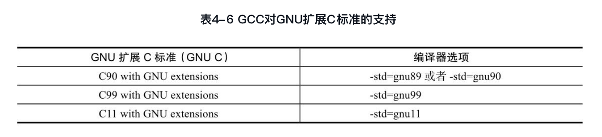
从总体上来讲，GCC对于C语言的语法分析采用的是一种自顶向下的语法推导过程。在进行自顶向下推导分析的过程中，由于部分推导式有时可能会产生冲突，因此需要对下一个或两个词法符号进行预读，从而消除冲突。因此，GCC中C语言的语法分析过程可以简述为：最多提前预读两个词法符号的自顶向下的语法推导过程。

###4.5.4 语法分析过程
GCC中的语法分析实现主要在gcc/c-parser.c中完成。该文件中提供了大量的以c_parser_开头的函数，用来自顶向下地完成C语言源代码的语法分析。

为了完成“最多提前预读两个词法符号的自顶向下的语法推导过程”, GCC需要在语法分析的过程中保存当前词法分析的信息，包括当前预读的词法符号（最多两个）、语法分析状态以及上下文信息等，这些信息通常保存在structc_parser结构体中。该结构体的定义如下：

```cpp
     typedef struct c_parser GTY(())
                 {
                   c_token tokens[2];                                 /*预读的词法符号*/
                   short tokens_avail;                                /*可用的预读词法符号的数目(取值为0,1,2)*/
                   BOOL_BITFIELD error : 1;                           /*是否已经从语法分析错误中恢复*/
                   BOOL_BITFIELD in_pragma : 1;                       /*是否在进行编译制导的处理*/
                   BOOL_BITFIELD in_if_block : 1;                     /*是否在处理最顶层的if语句*/
                   BOOL_BITFIELD lex_untranslated_string : 1;         /*是否对未转换的字符串进行词法分析*/
                   /* Objective-C信息 */
                   BOOL_BITFIELD objc_pq_context : 1;
                   BOOL_BITFIELD objc_need_raw_identifier : 1;
                 } c_parser;
```
GCC进行C语言语法分析的入口函数为c_parse_file，该函数的主要内容如下：

```cpp
                 void
                 c_parse_file (void)
                 {
                   c_parser tparser;

                   memset (&tparser, 0, sizeof tparser);
                   the_parser = &tparser;

                   /* 预读一个词法符号，如果是预处理符号，则进行编译的预处理 */
                   if (c_parser_peek_token (&tparser)->pragma_kind == PRAGMA_GCC_PCH_PREPROCESS)
                     c_parser_pragma_pch_preprocess (&tparser);    /*预处理*/

                   the_parser = GGC_NEW (c_parser);                /*创建c_parser结构体*/
                   *the_parser = tparser;

                   /* 从C语法中的translation_unit非终结符开始进行语法推导。 */
                   c_parser_translation_unit (the_parser);
                   the_parser = NULL;
                 }
```
若要深刻理解语法分析的过程，则必须对C语言的语法比较熟悉。建议在分析该部分内容时，能够准备一份C语言的语法规范及GNU C的扩展语法规范，将语法规则和语法分析的代码进行对照分析，对理解GCC的语法分析过程会有较大的帮助。
GCC对C语言进行语法分析时，采用了一种自顶向下的语法推导过程，为了应对自顶向下处理中的一些语法冲突，有时必须调用词法分析程序对词法符号进行预读（根据C语法规范，最多需要预读两个词法符号）。需要说明的是，GCC中C语言词法分析的过程嵌入在语法分析的过程之中，当语法分析需要一个词法符号的时候，就调用：

             c_lex_one_token(c_parser *parser, c_token *token);
从源文件中读取信息，解析出一个词法符号并存储在token中，或者调用

             c_parser_peek_token (c_parser *parser);
从已解析的词法符号中“窥探”下一个词法符号，也可以使用消耗掉下一个词法符号。

             c_parser_consume_token (c_parser *parser)
             