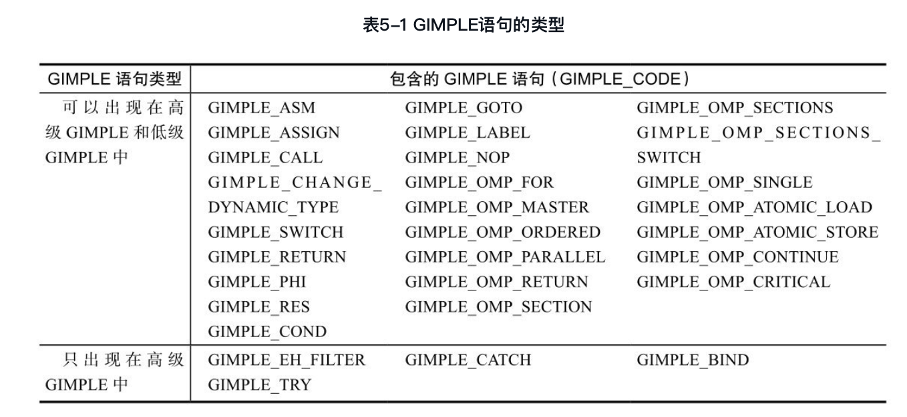

#
第五章 从AST/GENETIC到GIMPLE

##5.1 Gimple

**GENERIC**：简单的讲，GENERIC就是规范的AST。一般来说，如果一种前端语言的AST树均可以使用gcc/tree.h中所表示的树节点表示，那么该AST就是GENERIC AST。可以看出，GENERIC是一种规范的AST表示形式，引入GENERIC的目的就是力求寻找一种与前端语言无关的AST统一表示，便于对各种语言的AST进行一种通用的处理而已。从这个角度上，本书把AST和GENERIC合起来称为AST/GENERIC。实际上，在GCC中，很多语言的前端处理并不包含AST到GENERIC的转换，而是直接将AST转换成与语言无关的另外一种中间表示，即GIMPLE。

**GIMPLE**是一种三地址码的中间表示形式，是McGill University McCAT编译工程中SIMPLE中间语言的一种变化形式。GIMPLE与SIMPLE非常接近，但二者又有所不同，例如SIMPLE不支持goto语句，但GIMPLE支持。

GIMPLE中间形式由AST/GENERIC表达式转换而来，它们之间最主要的区别包括：
（1）AST形式与前端的编程语言是相关的，每种前端语言词法语法分析后形成的AST是异构的，缺乏一种规范的、适合于各种语言的通用表示方法。而GIMPLE中间表示形式则是语言无关的，任何语言的前端处理均应按照GIMPLE的规范，将该语言前端生成的AST/GENERIC形式转换成GIMPLE形式，从而提供给GCC进行后续语言无关的处理。
（2）AST/GENERIC是树形结构，而GIMPLE形式从本质上讲是线性的中间表示序列，可以更方便、更有效地进行后续的编译优化。需要注意的是，虽然GIMPLE是线性序列，但在GIMPLE的表示中，依然使用了大量的树节点，这些节点往往作为GIMPLE语句的操作数等元素出现。
（3）AST/GENERIC的属性节点类型非常多，而GIMPLE语句的类型相对较少。从AST及GIMPLE的形式上来说，二者之间的主要区别是：
	（1）在GIMPLE中通过引入临时变量保存中间结果，将AST表达式拆分成不超过三个操作数的元组（Tuples）。
	（2）AST中的控制结构，例如if-else、for、while等在GIMPLE表示中都被转换成条件跳转语句。
	（3）AST中的词法作用域（Lexical Scopes）在低级GIMPLE中被取消。
	（4）AST中的异常区域（Exceptional Region）被转换成一个单独的异常区域树（Exception Region Tree）。
在从AST向GIMPLE转换的过程中，GIMPLE的生成先后经历了两个阶段，分别称为高级GIMPLE（High-LevelGIMPLE）和低级GIMPLE（Low-Level GIMPLE）。在执行GIMPLE处理过程（GCC中称为Pass，参见6.1节）pass_lower_cf（参见6.2节）之前，GIMPLE的形式为高级GIMPLE，执行了该处理过程之后，GIMPLE就被完全转换成低级GIMPLE。高级GIMPLE中包含了一些例如GIMPLE_BIND等表示作用域的语句，还有一些例如GIMPLE_TRY等嵌套的表达式等；低级GIMPLE中就不存在GIMPLE_BIND、GIMPLE_TRY这些语句了。详细信息可以参见GCC internals。

表5-1给出了各种GIMPLE语句在高级GIMPLE和低级GIMPLE中的使用。

##5.2 GIMPLE语句

在$（GCC_SOURCE）/gcc/gimple.def文件中对各种GIMPLE语句进行了声明。该声明中包括了GIMPLE语句的标识（GIMPLE_CODE，用来描述该GIMPLE语句的语义）、名称以及获取该GIMPLE语句操作数的偏移量（该偏移量以DEFGSCODE宏定义中使用的结构体大小来计算）等基本信息。

上述DEFGSCODE（GIMPLE_symbol, printable name, structure）定义中，GIMPLE_symbol是该GIMPLE语句的操作类型码（即GIMPLE_CODE）, printable name表示该GIMPLE语句的打印名称，structure用来计算该GIMPLE语句存储结构中操作数的偏移地址。例如：
> DEFGSCODE(GIMPLE_COND, "gimple_cond", struct gimple_statement_with_ops)

声明的GIMPLE语句信息包括：
（1）该GIMPLE语句为条件语句，其GIMPLE_CODE为GIMPLE_COND；
（2）该GIMPLE语句的打印名称为“gimple_cond”；
（3）该GIMPLE语句存储时，使用的结构体为struct gimple_statement_with_ops，通过该结构体的相关信息，可以计算GIMPLE_COND语句操作数的偏移量，从而可以对其操作数进行访问。

