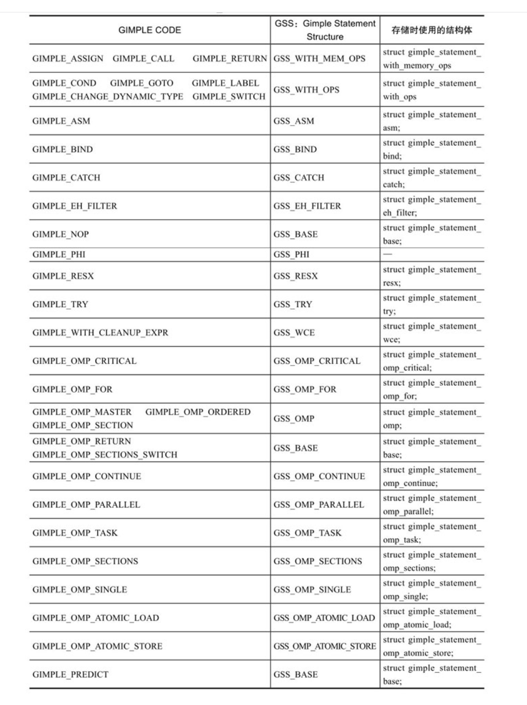

#<center>第五章 从AST/GENETIC到GIMPLE</center>
##5.1 Gimple

**GENERIC**：简单的讲，GENERIC就是规范的AST。一般来说，如果一种前端语言的AST树均可以使用gcc/tree.h中所表示的树节点表示，那么该AST就是GENERIC AST。可以看出，GENERIC是一种规范的AST表示形式，引入GENERIC的目的就是力求寻找一种与前端语言无关的AST统一表示，便于对各种语言的AST进行一种通用的处理而已。从这个角度上，本书把AST和GENERIC合起来称为AST/GENERIC。实际上，在GCC中，很多语言的前端处理并不包含AST到GENERIC的转换，而是直接将AST转换成与语言无关的另外一种中间表示，即GIMPLE。


**GIMPLE**是一种三地址码的中间表示形式，是McGill University McCAT编译工程中SIMPLE中间语言的一种变化形式。GIMPLE与SIMPLE非常接近，但二者又有所不同，例如SIMPLE不支持goto语句，但GIMPLE支持。

GIMPLE中间形式由AST/GENERIC表达式转换而来，它们之间最主要的区别包括：
（1）AST形式与前端的编程语言是相关的，每种前端语言词法语法分析后形成的AST是异构的，缺乏一种规范的、适合于各种语言的通用表示方法。而GIMPLE中间表示形式则是语言无关的，任何语言的前端处理均应按照GIMPLE的规范，将该语言前端生成的AST/GENERIC形式转换成GIMPLE形式，从而提供给GCC进行后续语言无关的处理。
（2）AST/GENERIC是树形结构，而GIMPLE形式从本质上讲是线性的中间表示序列，可以更方便、更有效地进行后续的编译优化。需要注意的是，虽然GIMPLE是线性序列，但在GIMPLE的表示中，依然使用了大量的树节点，这些节点往往作为GIMPLE语句的操作数等元素出现。
（3）AST/GENERIC的属性节点类型非常多，而GIMPLE语句的类型相对较少。从AST及GIMPLE的形式上来说，二者之间的主要区别是：
	（1）在GIMPLE中通过引入临时变量保存中间结果，将AST表达式拆分成不超过三个操作数的元组（Tuples）。
	（2）AST中的控制结构，例如if-else、for、while等在GIMPLE表示中都被转换成条件跳转语句。
	（3）AST中的词法作用域（Lexical Scopes）在低级GIMPLE中被取消。
	（4）AST中的异常区域（Exceptional Region）被转换成一个单独的异常区域树（Exception Region Tree）。
在从AST向GIMPLE转换的过程中，GIMPLE的生成先后经历了两个阶段，分别称为高级GIMPLE（High-LevelGIMPLE）和低级GIMPLE（Low-Level GIMPLE）。在执行GIMPLE处理过程（GCC中称为Pass，参见6.1节）pass_lower_cf（参见6.2节）之前，GIMPLE的形式为高级GIMPLE，执行了该处理过程之后，GIMPLE就被完全转换成低级GIMPLE。高级GIMPLE中包含了一些例如GIMPLE_BIND等表示作用域的语句，还有一些例如GIMPLE_TRY等嵌套的表达式等；低级GIMPLE中就不存在GIMPLE_BIND、GIMPLE_TRY这些语句了。详细信息可以参见GCC internals。

表5-1给出了各种GIMPLE语句在高级GIMPLE和低级GIMPLE中的使用。


##5.2 GIMPLE语句

在$（GCC_SOURCE）/gcc/gimple.def文件中对各种GIMPLE语句进行了声明。该声明中包括了GIMPLE语句的标识（GIMPLE_CODE，用来描述该GIMPLE语句的语义）、名称以及获取该GIMPLE语句操作数的偏移量（该偏移量以DEFGSCODE宏定义中使用的结构体大小来计算）等基本信息。

上述DEFGSCODE（GIMPLE_symbol, printable name, structure）定义中，GIMPLE_symbol是该GIMPLE语句的操作类型码（即GIMPLE_CODE）, printable name表示该GIMPLE语句的打印名称，structure用来计算该GIMPLE语句存储结构中操作数的偏移地址。例如：
> DEFGSCODE(GIMPLE_COND, "gimple_cond", struct gimple_statement_with_ops)

声明的GIMPLE语句信息包括：
（1）该GIMPLE语句为条件语句，其GIMPLE_CODE为GIMPLE_COND；
（2）该GIMPLE语句的打印名称为“gimple_cond”；
（3）该GIMPLE语句存储时，使用的结构体为struct gimple_statement_with_ops，通过该结构体的相关信息，可以计算GIMPLE_COND语句操作数的偏移量，从而可以对其操作数进行访问。


##5.3 GIMPLE的表示与存储
本节主要介绍GCC 4.4.0中所包含的33种GIMPLE语句的表示与存储。
也就是说，在GCC中，就是使用这21种结构体来表示和存储所有5.2节中给出的33种GIMPLE语句，而且都可以使用union gimple_statement_d对其进行统一的描述。

```cpp
        union gimple_statement_d
        {
          struct gimple_statement_base gsbase;
          struct gimple_statement_with_ops gsops;
          struct gimple_statement_with_memory_ops gsmem;
          struct gimple_statement_omp omp;
          struct gimple_statement_bind gimple_bind;
          struct gimple_statement_catch gimple_catch;
          struct gimple_statement_eh_filter gimple_eh_filter;
          struct gimple_statement_phi gimple_phi;
          struct gimple_statement_resx gimple_resx;
          struct gimple_statement_try gimple_try;
          struct gimple_statement_wce gimple_wce;
          struct gimple_statement_asm gimple_asm;
          struct gimple_statement_omp_critical gimple_omp_critical;
          struct gimple_statement_omp_for gimple_omp_for;
          struct gimple_statement_omp_parallel gimple_omp_parallel;
          struct gimple_statement_omp_task gimple_omp_task;
          struct gimple_statement_omp_sections gimple_omp_sections;
          struct gimple_statement_omp_single gimple_omp_single;
          struct gimple_statement_omp_continue gimple_omp_continue;
          struct gimple_statement_omp_atomic_load gimple_omp_atomic_load;
          struct gimple_statement_omp_atomic_store gimple_omp_atomic_store;
        };
```

也就是说，在GCC中，就是使用这21种结构体来表示和存储所有5.2节中给出的33种GIMPLE语句，而且都可以使用union gimple_statement_d对其进行统一的描述。

首先来看struct gimple_statement_base的定义。

```cpp
        struct gimple_statement_base
        {
          ENUM_BITFIELD(gimple_code) code : 8;                        /*GIMPLE_CODE*/
          unsigned int no_warning             : 1;
          unsigned int visited                : 1;
          unsigned int nontemporal_move       : 1;
          unsigned int plf                    : 2;
          unsigned modified                   : 1;
          unsigned has_volatile_ops           : 1;
          unsigned references_memory_p        : 1;
          unsigned int subcode                : 16;                   /*子操作代码*/
          unsigned uid;
          location_t location;                                        /*位置信息*/
          unsigned num_ops;                                           /*操作数个数*/
          struct basic_block_def *bb;
          tree block;
        };
```

该结构体是所有GIMPLE存储结构体的“基类”，描述了GIMPLE语句的基本特性，例如，GIMPLE_CODE、操作数个数、源文件中的位置以及语法块信息等，
* code字段描述的是所存储的GIMPLE语句的类型（即GIMPLE_CODE），这些GIMPLE_CODE的值由5.2节中给出的枚举类型enum gimple_code描述；
* num_ops字段给出了该GIMPLE语句操作数的个数；
* bb字段给出了该GIMPLE语句所在的基本块（basic block）信息；
* block字段则描述了该GIMPLE语句所在的词法语句块信息。

对于某种GIMPLE语句分配其存储空间时，首先通过该语句的GIMPLE_CODE作为参数，由函数gss_for_code()获取该GIMPLE语句对应的GSS（GIMPLE Statement Structure）的枚举值，再由该GSS的值或者GIMPLE_CODE来确定存储结构体及其大小。

常见的GIMPLE_CODE对应的GSS及存储该GIMPLE语句的结构体之间的关系如表5-2所示。通过表5-2可以看出，为一个GIMPLE_RETURN语句分配存储空间时，其GSS值为GSS_WITH_MEM_OPS，相应的存储结构体为struct gimple_statement_with_memory_ops，如果该GIMPLE_RETURN语句的返回值RETVAL不为空时，该返回值将作为GIMPLE_RETURN语句的操作数存储在该结构的tree op[1]字段中。



##5.4 GIMPLE语句的操作数
在gcc/gimple.c中定义了一个函数，用来判断某个GIMPLE语句是否具有操作数，其定义如下：

```cpp
        /* 判断GIMPLE语句g是否有操作 */
        static inline bool
        gimple_has_ops (const_gimple g)
        {
          return gimple_code (g) >= GIMPLE_COND && gimple_code (g) <= GIMPLE_RETURN;
        }
```

也就是说，当GIMPLE_CODE介于GIMPLE_COND及GIMPLE_RETURN之间（包括这两个GIMPLE_CODE）时，该GIMPLE语句具有操作数。对于有操作数的GIMPLE语句（GCC 4.4.0中包括9种），可以采用的存储结构体只可能是如下的3种之一：

```cpp
	  struct gimple_statement_asm；
        struct gimple_statement_with_memory_ops；
        struct gimple_statement_with_ops
```


