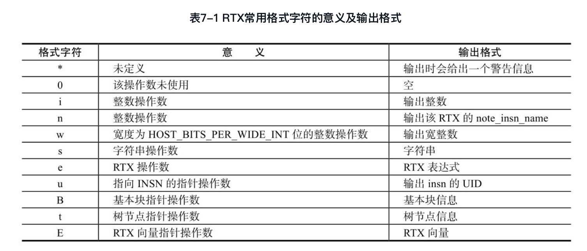
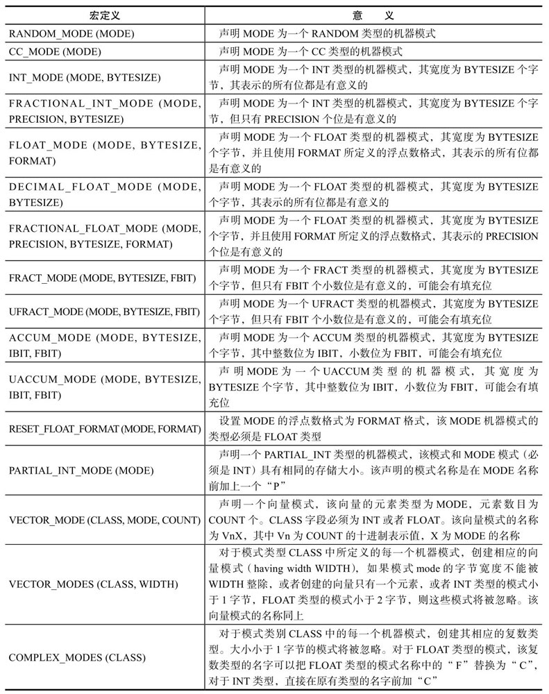
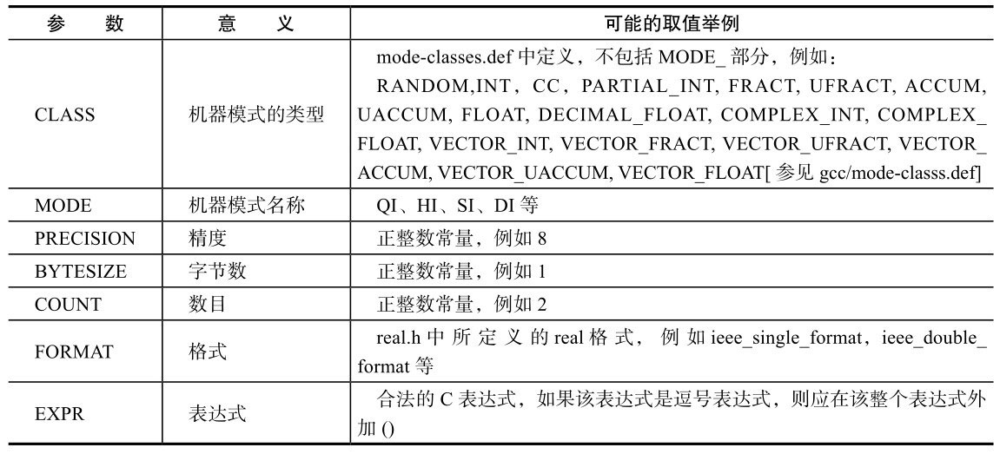
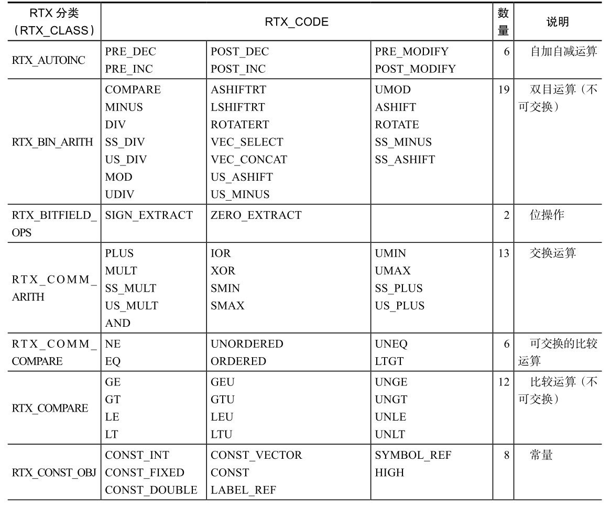
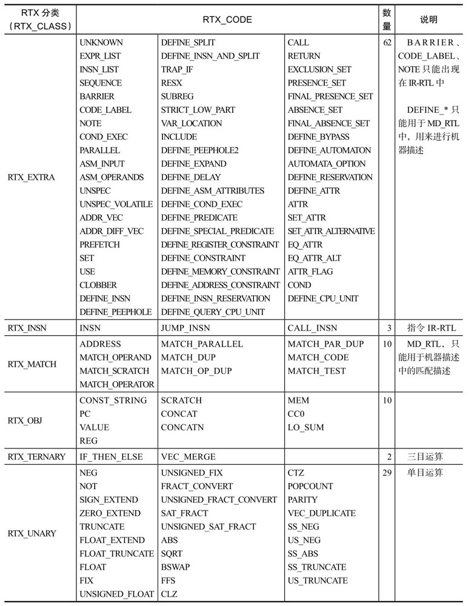
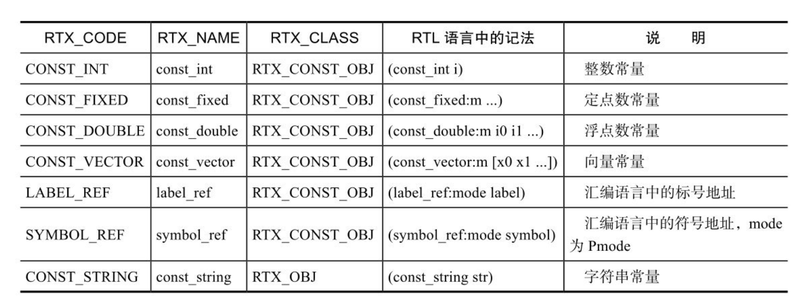
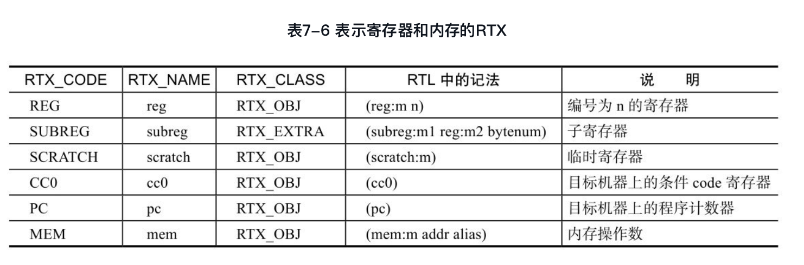
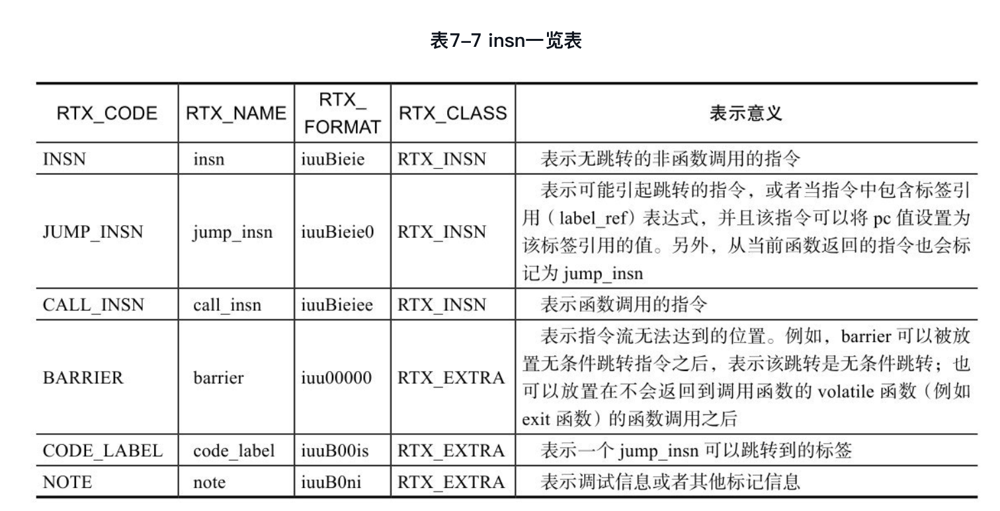
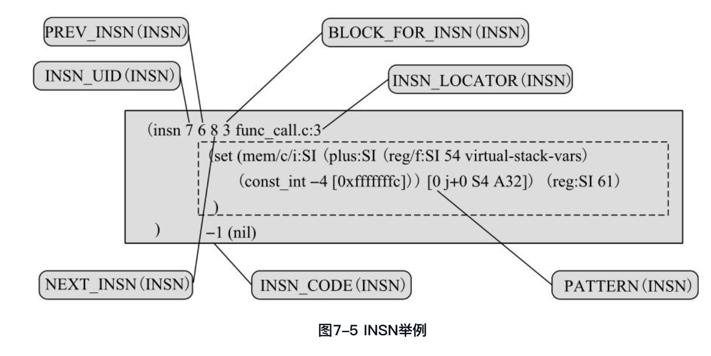

#<center>第7章 RTL</center>

为了完成上述功能，GCC中引入了寄存器传输语言（Register Transfer Language, RTL）。RTL采用了类似LISP语言的列表形式，描述了每一条指令的语义动作。根据其作用，RTL可以分为两大类：（1）内部格式（Internal Form）：这种格式通常由GIMPLE转化而成，是程序代码的另外一种中间表示形式，可以称为IR-RTL（Intermediate Representation RTL）；
（2）文本格式（Textual Form）：用于机器描述（Machine Description）文件中，进行机器描述时所采用的RTL形式，可以称为MD-RTL（Machine Description RTL）。

GIMPLE中间形式在转化成IR-RTL时，会按照GCC设计时所定义的规则，将每个GIMPLE语句转换成具有某个标准模板名称（Standard Pattern Name, SPN）对应的RTL，该转换规则是与机器无关的。从MD-RTL来看，某个标准模板名称所定义的指令模板则是与机器相关的，对于不同的机器，其实现的内容也是各不相同的，但从IR-RTL来看，这些标准模板名称所对应的操作语义则是与机器无关的。正是因为采用了标准模板名称，通过将GIMPLE_CODE和MD-RTL中具有标准模板名称的指令模板进行匹配，从而实现机器无关的GIMPLE表示到机器相关的RTL之间的转换.

图7-1给出了RTL与GIMPLE以及目标机器汇编代码之间的关系，涉及GIMPLE到RTL的转换、机器描述以及RTL到汇编代码的生成等关键问题。MD-RTL主要用来描述目标机器的指令模板，其中具有标准模式名称（StandardPattern Name, SPN）的指令模板用来指导IR-RTL的构造，从而实现机器无关的GIMPLE到机器相关的IR-RTL的转换。在由IR-RTL生成目标机器汇编代码时，将进一步依据MD-RTL中所定义的所有指令模板，完成IR-RTL到指令模板的匹配，并根据匹配指令模板中的汇编代码输出格式生成汇编代码。可以看出，标准指令模板名称对于IR-RTL的构造具有非常重要的意义，是完成机器无关的GIMPLE到机器相关的RTL转换的重要依据，也是将机器相关的汇编代码与机器无关的GIMPLE进行分离的重要媒介，从而使得GCC的中间处理与具体的目标机器特性隔离，便于GCC完成对多种目标机器的支持。


##7.1 RTL中的对象类型
RTL中间表示中包括五种对象类型（Object Type），分别是表达式（Expression）、整数（Integer）、宽整数（Wide Integer）、字符串（String）和向量（Vector）。

RTL中的表达式也称为RTX（RTL eXpression），它是RTL中最重要的一类对象。根据RTX表达式语义的不同，GCC定义了众多的RTX代码（RTX_CODE），可以通过GET_CODE（x）和PUT_CODE（x）获取和设置RTX x的代码。需要强调的是，RTX_CODE所表达的语义是机器无关的。RTX_CODE与TREE_CODE、GIMPLE_CODE类似，分别是RTX表达式、TREE节点及GIMPLE语句的语义标识。

RTX的声明在gcc/rtl.def中使用宏定义的方式进行描述，形式为：
>  DEF_RTL_EXPR(RTL_CODE, NAME, PRINT_FORMAT, RTX_CLASS)

上述声明包括四个部分，分别为RTL_CODE、NAME、PRINT_FORMAT及RTX_CLASS。
> DEF_RTL_EXPR(GE, "ge", "ee", RTX_COMPARE)

##7.2 RTX_CODE
```cpp
        #define RTX_CODE          enum rtx_code
        enum rtx_code   {
        #define DEF_RTL_EXPR(ENUM, NAME, FORMAT, CLASS)    ENUM ,
        #include "rtl.def"
        #undef DEF_RTL_EXPR
        LAST_AND_UNUSED_RTX_CODE
        };
```

```cpp
      enum rtx_code{
        UNKNOWN
        EXPR_LIST
        INSN_LIST
        SEQUENCE
        ADDRESS
        INSN
        JUMP_INSN
        CALL_INSN
        BARRIER
        /* 限于篇幅，省略大量代码 */
        LAST_AND_UNUSED_RTX_CODE
        };
```

##7.3 RTX类型
每种不同代码（RTX_CODE）的RTX可以表达不同的语义。根据其语义的不同，RTX可以分成如下几种类型（称为RTX CLASS），定义在rtl.h中，注释中给出了较详细的解释。

```cpp
        /*Register Transfer Language EXPRESSIONS CODE CLASSES*/
        enum rtx_class   {
        /* 0 */
          RTX_COMPARE,                      /*非对称的比较，例如LT、GEU等*/
          RTX_COMM_COMPARE,                 /*对称的比较，例如EQ、ORDERED等*/
          RTX_BIN_ARITH,                    /*不可交换的双目运算，例如MINUS、DIV、ASHIFTRT等*/
          RTX_COMM_ARITH,                   /*可交换的双目运算，例如PLUS、AND等*/
        /* 4 */
                RTX_UNARY,                         /*单目算数操作，例如NEG、NOT、ABS等*/
                RTX_EXTRA,                         /*其他*/
                RTX_MATCH,                         /*RTX代码中的匹配条件，例如MATCH_DUP等*/
                RTX_INSN,                          /*RTX代码，例如INSN、JUMP_INSN、CALL_INSN等*/
              /* 8 */
                RTX_OBJ,                           /*实际的对象，例如寄存器或者内存地址*/
                RTX_CONST_OBJ,                     /*常量对象，包括HIGH*/

                RTX_TERNARY,                       /*三目运算，例如IF_THEN_ELSE*/
                RTX_BITFIELD_OPS,                  /*位操作*/
                RTX_AUTOINC                        /*自增运算，例如POST_INC等*/
              };
```

##7.4 RTX输出格式
在GCC的运行和调试过程中，有时候需要输出RTX的内容，因此需要定义RTX操作数的输出格式。这些输出格式使用字符串描述，字符串中的每个字符定义了该RTX中对应的每一个操作数的输出格式

```cpp
        const char * const rtx_format[NUM_RTX_CODE] = {
        "*",                  /*RTX_CODE = UNKNOWN*/
        "ee",                 /*RTX_CODE = EXPR_LIST*/
        "ue",                 /*RTX_CODE = INSN_LIST*/
        "E",                  /*RTX_CODE = SEQUENCE*/
        "e",                  /*RTX_CODE = ADDRESS*/
        "iuuBieie",           /*RTX_CODE = INSN*/
        "iuuBieie0",          /*RTX_CODE = JUMP_INSN*/
        "iuuBieiee",          /*RTX_CODE = CALL_INSN*/
        "iuu00000",           /*RTX_CODE = BARRIER*/
        "iuuB00is",           /*RTX_CODE = CODE_LABEL*/
        "iuuB0ni",            /*RTX_CODE = NOTE*/
        "ee",                 /*RTX_CODE = COND_EXEC*/
        "E",                  /*RTX_CODE = PARALLEL*/
        "si",                 /*RTX_CODE = ASM_INPUT*/
        "ssiEEi",             /*RTX_CODE = ASM_OPERANDS*/
        "Ei",                 /*RTX_CODE = UNSPEC*/
        /* 限于篇幅，省略后续的内容 */
        }
```

表7-1给出了常见的输出格式字符所代表的意义。


##7.5 RTX操作数
##7.6 RTX的机器模式
机器模式表示在机器层次上数据的大小及其格式。每个RTX均有其机器模式的描述。一般来说，在gcc/machmode.def文件中定义了GCC中默认所支持的所有机器模式，这些机器模式能被绝大多数的目标机器所支持。另外，用户也可以在config/${target}/${target}-modes. def中定义与特定目标机器相关的机器模式，其中${target}表示目标机器的名称。

表7-2 机器模式定义宏举例


表7-3 机器模式宏定义中所使用的参数


##7.7 RTX的存储
RTX使用结构体rtx_def进行存储，定义在gcc/rtl.h中，比如：

```cpp
        struct rtx_def
        {
          ENUM_BITFIELD(rtx_code) code: 16;
          ENUM_BITFIELD(machine_mode) mode : 8;
          unsigned int jump : 1;
          unsigned int call : 1;
          unsigned int unchanging : 1;
          unsigned int volatil : 1;
          unsigned int in_struct : 1;
          unsigned int used : 1;
          unsigned frame_related : 1;
          unsigned return_val : 1;
          union u {
            rtunion fld[1];
            HOST_WIDE_INT hwint[1];
            struct block_symbol block_sym;
            struct real_value rv;
            struct fixed_value fv;
          } u;
        };
```
##7.8 RTX表达式
RTL包括IR-RTL和MD-RTL，分别为源代码的中间表示和机器描述。对于RTX表达式来说，有些RTX只能出现在IR-RTL中，有些只能用于MD-RTL，有些在两者中均可出现。表7-4也给出了RTX在IR-RTL和MD-RTL中的使用情况。

表7-4 RTX分类及其使用概况



###7.8.1 常量
RTL中定义了一些表示常量的RTX，用来表示各种常量，例如整数常量、定点数常量、字符串常量等。表7-5给出了常见的常量RTX。

表7-5 表示常量的RTX


###7.8.2 寄存器和内存
GCC中定义了一些RTX表达式，用来进行寄存器和存储的访问，如表7-6所示。


###7.8.3 算术运算
###7.8.4 比较运算
###7.8.5 副作用
上面介绍的这些RTX均表示一个“值”，而不是一个“动作”。机器指令本身不会产生任何表示值的RTX，它们仅仅通过改变机器状态的“动作”来完成对这些值的处理，这些RTX所描述的“动作”称之为RTX的“副作用”（SideEffect）。一般来说，机器指令insn的body部分通常是具有“副作用”的RTX，用来表示一些“动作”，而本节之前介绍的RTX通常只是作为这些具有副作用的RTX的操作数出现。

####1.（set lval x）
表示一个动作，将值x存储到lval对应的rtx中。lval可以是reg、subreg、mem、pc、cc0及parallel等RTX。如果lval为reg、subreg或者mem等有机器模式要求的RTX，那么x必须满足其机器模式的要求。如果lval为（cc0），那么x必须是一个表示比较的表达式或者是一个表示值的rtx。例如表达式：

####2.（return）
当目标机器上的函数返回可以用一条指令完成时，可以单独使用（return），表示从当前函数返回的动作。而在一些机器上，函数的返回必须通过多条指令实现，此时函数的返回动作则通过跳转实现。

####3.（call function nargs）
该RTX表示一个函数调用的动作，其中，function是一个mem表达式，其值为被调用函数的地址；nargs表达式可以表示堆栈参数的字节数，也可以表示参数寄存器的个数。

####4.（clobber x）
表示可能会存储一个不可预知的或一个未明确描述的值到x中，其中x必须是reg、scratch、parallel或者mem类型的表达式。也就是说，x的值可能会被修改。

####5.（use x）
表示需要使用x的值。

##7.9 IR-RTL
前面提到过，和AST、GIMPLE相同，RTL也是GCC的一种中间表示形式。RTL可以用来进行机器描述，也可以描述由GIMPLE形式转换而来的程序代码信息。GCC中描述程序代码信息的RTL被称为insn，用来表示程序中的算术运算、程序跳转、标号等，也可以用来表示各种说明信息。insn包括了如下6种RTX类型：


###7.9.1 INSN
RTX_CODE为INSN的insn表示非跳转、非函数调用的指令。INSN的RTX声明为：[插图]可以看出，INSN表达式的RTX_CODE为insn, RTX类型为RTX_INSN，其输出格式为“iuuBieie”，其中第3操作数（操作数编号从0开始）为基本块信息指针，使用BLOCK_FOR_INSN(INSN)宏进行访问，其输出格式为“B”；第4操作数为位置指示，描述了该INSN对应的源代码的行数，使用INSN_LOCATOR(INSN)宏进行访问，其输出格式为“i”；第5操作数为该INSN的主体（称为insn的pattern或者body部分），描述了该INSN的指令模板，可以使用PATTERN(INSN)宏进行访问，其输出格式为“e”；第6操作数为INSN的代码（INSN_CODE），即该INSN操作所对应的指令模板索引值，使用INSN_CODE(INSN)进行访问，其输出格式为“i”。最后一个操作数，即第7操作数未使用。

图7-5给出了该insn的详细描述，可以看出该INSN的INSN_UID为7，其前驱的INSN_UID为6，后继的INSN_UID为8，属于基本块3，对应源文件func_call.c的第3行代码，在机器描述文件中的指令模板索引值为-1，表示该INSN尚未被识别（recoginzed），即尚未完成指令模板的匹配操作。




