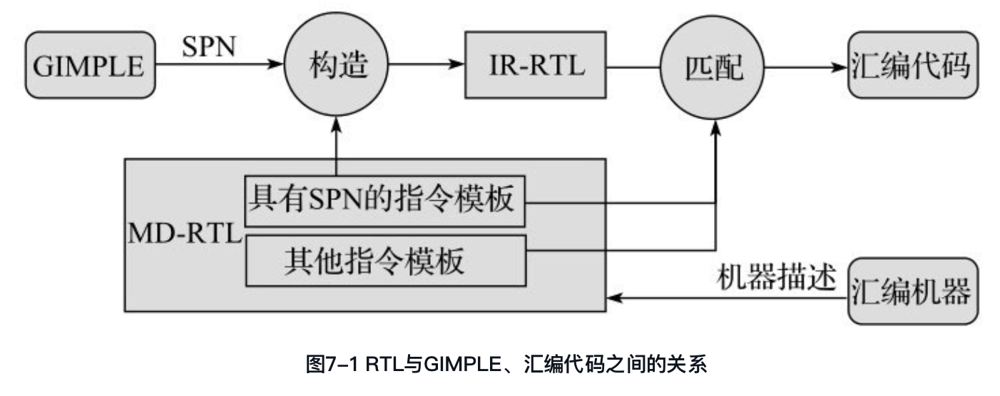

#<center>第7章 RTL</center>

为了完成上述功能，GCC中引入了寄存器传输语言（Register Transfer Language, RTL）。RTL采用了类似LISP语言的列表形式，描述了每一条指令的语义动作。根据其作用，RTL可以分为两大类：（1）内部格式（Internal Form）：这种格式通常由GIMPLE转化而成，是程序代码的另外一种中间表示形式，可以称为IR-RTL（Intermediate Representation RTL）；
（2）文本格式（Textual Form）：用于机器描述（Machine Description）文件中，进行机器描述时所采用的RTL形式，可以称为MD-RTL（Machine Description RTL）。

GIMPLE中间形式在转化成IR-RTL时，会按照GCC设计时所定义的规则，将每个GIMPLE语句转换成具有某个标准模板名称（Standard Pattern Name, SPN）对应的RTL，该转换规则是与机器无关的。从MD-RTL来看，某个标准模板名称所定义的指令模板则是与机器相关的，对于不同的机器，其实现的内容也是各不相同的，但从IR-RTL来看，这些标准模板名称所对应的操作语义则是与机器无关的。正是因为采用了标准模板名称，通过将GIMPLE_CODE和MD-RTL中具有标准模板名称的指令模板进行匹配，从而实现机器无关的GIMPLE表示到机器相关的RTL之间的转换.

图7-1给出了RTL与GIMPLE以及目标机器汇编代码之间的关系，涉及GIMPLE到RTL的转换、机器描述以及RTL到汇编代码的生成等关键问题。MD-RTL主要用来描述目标机器的指令模板，其中具有标准模式名称（StandardPattern Name, SPN）的指令模板用来指导IR-RTL的构造，从而实现机器无关的GIMPLE到机器相关的IR-RTL的转换。在由IR-RTL生成目标机器汇编代码时，将进一步依据MD-RTL中所定义的所有指令模板，完成IR-RTL到指令模板的匹配，并根据匹配指令模板中的汇编代码输出格式生成汇编代码。可以看出，标准指令模板名称对于IR-RTL的构造具有非常重要的意义，是完成机器无关的GIMPLE到机器相关的RTL转换的重要依据，也是将机器相关的汇编代码与机器无关的GIMPLE进行分离的重要媒介，从而使得GCC的中间处理与具体的目标机器特性隔离，便于GCC完成对多种目标机器的支持。




##7.1 RTL中的对象类型
RTL中间表示中包括五种对象类型（Object Type），分别是表达式（Expression）、整数（Integer）、宽整数（Wide Integer）、字符串（String）和向量（Vector）。

RTL中的表达式也称为RTX（RTL eXpression），它是RTL中最重要的一类对象。根据RTX表达式语义的不同，GCC定义了众多的RTX代码（RTX_CODE），可以通过GET_CODE（x）和PUT_CODE（x）获取和设置RTX x的代码。需要强调的是，RTX_CODE所表达的语义是机器无关的。RTX_CODE与TREE_CODE、GIMPLE_CODE类似，分别是RTX表达式、TREE节点及GIMPLE语句的语义标识。

RTX的声明在gcc/rtl.def中使用宏定义的方式进行描述，形式为：
>  DEF_RTL_EXPR(RTL_CODE, NAME, PRINT_FORMAT, RTX_CLASS)

上述声明包括四个部分，分别为RTL_CODE、NAME、PRINT_FORMAT及RTX_CLASS。
> DEF_RTL_EXPR(GE, "ge", "ee", RTX_COMPARE)

##7.2 RTX_CODE
```cpp
        #define RTX_CODE          enum rtx_code
        enum rtx_code   {
        #define DEF_RTL_EXPR(ENUM, NAME, FORMAT, CLASS)    ENUM ,
        #include "rtl.def"
        #undef DEF_RTL_EXPR
        LAST_AND_UNUSED_RTX_CODE
        };
```

```cpp
      enum rtx_code{
        UNKNOWN
        EXPR_LIST
        INSN_LIST
        SEQUENCE
        ADDRESS
        INSN
        JUMP_INSN
        CALL_INSN
        BARRIER
        /* 限于篇幅，省略大量代码 */
        LAST_AND_UNUSED_RTX_CODE
        };
```


