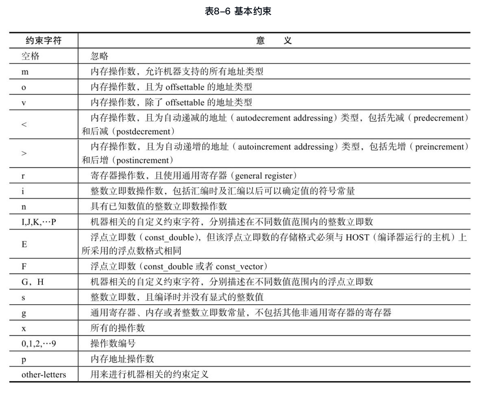

#
第8章 机器描述文件\${target}.md

机器描述主要包括以下两个部分：
（1）机器描述（Machine Description, MD）文件，即\${target}.md文件，其中\${target}为目标系统名称，主要描述了目标机器所支持的每条指令的指令模板（Instruction Pattern，即Insn Pattern）；
（2）机器描述的头文件及c文件，即${target}.[ch]文件，主要描述了与机器相关的变量声明与函数实现，同时用来配合md文件，实现其指令模板里变量的定义及其函数代码的实现等。

另外，从代码生成的角度看，整个GCC编译器的编译过程主要包括：
（1）编译器前端（Front End）读取源文件，并建立抽象语法树，即完成高级语言源代码到AST/GENERIC的转换；
（2）将与语言相关的AST/GENERIC转换成与语言无关的GIMPLE中间表示，并在此基础上完成各种与目标机器无关的优化；
（3）通过机器描述文件，提取各种具有标准指令模板名称的指令模板，并以这些指令模板为依据，将GIMPLE中间表示转换成RTL语言表示的insn序列，即完成RTL的构造，随后在此基础上，完成各种与目标机器相关的优化；
（4）对于insn序列中的每一个insn，分别和机器描述文件中的指令模板进行匹配，如果匹配成功，则提取该指令模板中的指令输出模板，并以此生成汇编代码。

##8.1 机器描述文件
机器描述就是使用规范的RTL语言对目标机器的特性进行描述。由于目标机器的特性千差万别，尤其是各种机器的指令系统各不相同，为了方便GCC提取目标机器的各种特性，必须使用规范的描述语言RTL（这里是MD-RTL）进行机器描述。

机器描述文件主要包含了表8-1中的内容，主要包括各种指令模板（Insn Pattern）的定义、常量（Constant）定义、属性（Attribute）定义、自定义断言（User-Defined Predicate）、自定义约束（User-DefinedConstraint）、枚举器（Iterator）定义、流水线（Pipeline）声明、窥孔优化（Peephole Optimization）定义等。

##8.2 指令模板
MD文件包含了目标机器所支持的每一条指令的指令模板，其形式如下：

        (define_insn 指令模板名称
          RTL模板
          条件
          输出模板
          属性
        )

指令模板定义中主要由指令模板名称、RTL模板、条件、输出模板及属性部分组成。其中，指令模板的名称（Pattern Name）由字符串给出，唯一地描述了该指令模板。RTL模板（RTL Template）提供了一个不完整的RTX向量，用来描述指令的RTX表示形式，如果该RTX向量只有一个元素，则表示普通的指令模板，也可以有多个元素，表示并行的（Parallel）指令模板。条件（Condition）部分是一个C语言的表达式，是用来判断某个insn是否与该指令模板匹配的最后条件。输出模板（Output Template）部分描述了该指令模板转换成目标汇编代码时的输出格式。最后一部分是属性（Attribute）部分，用来设置该指令的一些属性值，该部分通常可以省略。

图8-1给出了MIPS机器中一条指令模板的具体实例（见gcc/config/mips/mips.md）。该指令模板由define_insn描述，其名称为“*addsi3_extended”; RTL模板部分为一个不完整的RTX表达式，其中的部分操作数使用match_operand表达式描述，用来描述该操作数的一些匹配条件；条件部分则使用一个C语言的表达式，该表达式用来描述insn与该指令模板是否匹配的最后一个条件，如果返回为true，则给定的insn与该指令模板匹配，否则为不匹配；指令输出模板部分则给出了不同情况下，该指令模板对应的汇编代码的输出格式；最后的属性设置部分则设置了属性“type”的值为“arith”，设置属性“mode”的值为“SI”。

###8.2.1 模板名称
标准指令模板名称（Standard Pattern Name, SPN）是GCC中预定义的一些指令模板的名称。在GIMPLE语句到IR-RTL的转换过程中，每个特定语义的GIMPLE语句都被转换成某个对应的具有特定标准模板名称的IR-RTL，这些模板的名称在GCC的设计阶段就已经事先确定，但其内容与目标机器有关。

GIMPLE语句到IR-RTL的转换可以看做两个阶段：
（1）GIMPLE到SPN：在这个阶段中，每个SPN只是某个IR-RTL模板的抽象代表，从GIMPLE语句到SPN的映射是GCC中事先预定好的（Hard-coded），不会随着目标机器的不同而变化。因此，该阶段的映射是与机器无关的。
（2）SPN到IR-RTL。在这个阶段中，根据SPN从机器描述文件中提取名称与SPN相匹配的指令模板，并根据该模板构造出对应的IR-RTL。可以看出，IR-RTL的形式是由目标机器中定义的指令模板所决定，反映了目标机器的特性，是与机器紧密相关的。

###8.2.2 RTL模板
图8-2中给出的实例细化了图8-1中指令模板中的RTL模板部分。在这个例子中，该RTL模板中RTX向量只包含了一个表示赋值（Assignment）语义的RTX表达式，其RTX_CODE为SET，简称为set RTX。set RTX有两个操作数，均为RTX类型。

RTL模板的功能主要包括两种：匹配和构造。
（1）匹配（Matching）：用来描述包含该RTL模板的指令模板是否可以和特定的IR-RTL完成匹配，以及如何获得该IR-RTL的操作数。对于匹配操作来说，IR-RTL的形式及其操作数应该满足该RTL模板所要求的匹配条件。匹配发生在insn已经生成，需要进行insn后续操作，例如利用insn生成目标代码时。
（2）构造（Construction）：对于命名的指令模板来说，RTL模板也描述了如何利用给定的操作数实现该指令模板对应的insn的构造。对于构造来说，即从GIMPLE形式生成insn时，需要从GIMPLE语句中提取相应的操作数，并替换RTL模板中的操作数占位符。构造的过程发生在insn的生成过程（即从GIMPLE生成RTL的过程）中。

在RTL模板中，通过定义一些特殊的匹配表达式来描述匹配条件，主要包括表8-3中的RTL表达式。

#####断言
断言（Predicate）是RTL模板中操作数是否满足某种条件的判定过程，通常由一个描述断言函数名称的字符串来表示。

GCC中的断言可以分为两类，即目标机器无关的断言（Machine-Independent Predicates）和目标机器相关的断言（Machine-Specific Predicates）。

目标机器无关的断言通常完成一些通用的操作数和操作符类型的判断，例如常量、立即数、寄存器操作数、内存操作数等，这些断言在大部分机器中均有大量的使用，表8-4给出了GCC 4.4.0中所给出的一些目标机器无关的断言。

在有些目标机器描述中，操作数不能用机器无关的断言表示时，用户可以使用define_predicate和define_special_predicate自定义其他的断言表达式。这些表达式包括以下三个操作数：
（1）断言名称，这些名称会被match_operand或match_operator所调用。
（2）一个RTL表达式，用来判断该操作数是否满足条件，这些表达式必须为表8-5中给出的形式。

（3）一个可选的c代码块，如果该c代码块的表达式满足，则该断言返回true，否则返回false。

####约束
在match_operand中，可以指定操作数约束（operand constraint），这些约束对断言所允许的操作数进行更详细的描述。例如，约束条件可以进一步定义操作数是否可以使用寄存器以及使用何种寄存器，也可以说明操作数是否可以是一个内存引用以及其地址类型，还可以描述该操作数是否可以是一个立即数常量以及其可能的值等。GCC中的约束使用字符串表示。

（1）基本约束。表8-6给出了GCC中所定义的一些基本约束，这些约束均采用特殊的字符进行表示，分别代表某种特定的意义。

（2）多选择约束。有些时候，单个指令模板可以使用多种不同的操作组合。例如，在m68k机器中，一个逻辑“或”指令，可以对寄存器和1个立即数进行或操作，并将结果保存到内存地址中，或者对任意两个操作数进行或操作，并将结果保存在寄存器中，但是不能将两个内存地址进行或操作。这些不同的操作数约束组合可以使用多选择约束进行表示。每个操作数的约束选择可以表示为：“选择1的约束，选择2的约束，…”。每一种选择的约束均由基本约束和约束修饰字符所组成的字符串来表示。
（3）约束修饰字符。为了更细致地描述约束条件，GCC的约束还可以使用约束修饰字符（Constraint ModifierCharacters），表8-7列出了常用的约束修饰字符，并说明了其表示的具体含义。

###8.2.3 条件
###8.2.4 输出模板
指令模板中的输出模板主要用来表示该指令模板匹配后如何输出目标汇编代码。输出模板使用字符串描述，除了字符串中的一些特殊字符串需要进行操作数替换，其他将被原样输出到汇编语言中，输出模板中常见的特殊控制字符串如表8-8所示。

###8.2.5 属性

##8.3 定义RTL序列
 在某些特定的机器上，一个具有标准模板名称的指令模板所生成的指令不能被一条insn所表示，但是可以用一系列的insn表示，此时就可以利用define_expand来描述如何生成这一系列的insn。与define_insn所不同的是，define_expand只在RTL构造时使用。
 
 define_expand使用了4个操作数：
 （1）名称：每个define_expand必须有唯一的名称。
 （2）RTL模板：RTL表达式的向量，用来表示一系列单独的指令，与define_insn所不同的是，该模板中不包括隐式的并行含义。define_expand中的RTL模板只在RTL构造时使用，而不参与代码生成时的匹配过程。
 （3）条件：C表达式的字符串，该表达式根据GCC运行时命令行所选择的目标机器的子类型（sub-classes）来描述该模板的可用性（Availability）。这一点与具有标准模板名称的define_insn中的条件部分很类似。因此，如果该条件存在，那么该条件不应该依赖于需要匹配的insn中的数据，而只应该与目标机器类型标志（Target-Machine-Type Flag）有关。
 （4）准备语句：包含0个或者多个C语句的字符串，这些C语句在从RTL模板生成RTL代码之前执行。通常这些语句会给RTL生成准备一些临时的寄存器，作为RTL模板中的内部操作数使用，当然，这些语句也可以通过调用一些例程（如emit_insn函数）等直接生成insn，这些insn将插入在由RTL模板生成的insn之前。
 图8-3给出了一个define_expand的实例。
 

##8.4 指令拆分
 在某些特定的目标机器中，可以对一些复杂的指令模板进行分解（split），即将一个复杂的指令模板分解成多个简单的指令模板，从而生成多个简单的insn。
 
##8.5 枚举器
##8.6 窥孔优化
窥孔优化（Peephool Optimization）是一种局部优化方式，编译器仅仅在一个基本块或者多个基本块中，针对已经生成的代码，结合CPU指令的特点，通过一些认为可能带来性能提升的转换规则，或者整体的分析，进行指令转换，从而提升代码的性能。尽管这些代码转换很局部、很小，但可能带来很大的性能提升。

在机器描述文件中，可以两种窥孔优化的方式：
（1）define_peephole：优化生成汇编代码（RTL to Text Peephole Optimizers）；
（2）define_peephole2：优化生成新的RTL（RTL to RTL Peephole Optimizers）。
 
 