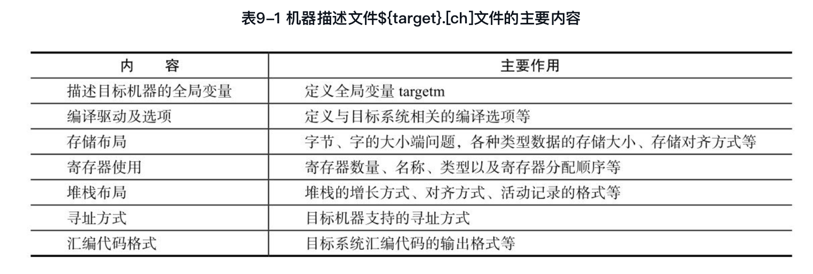
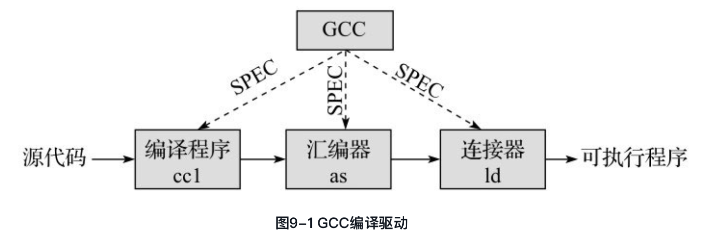
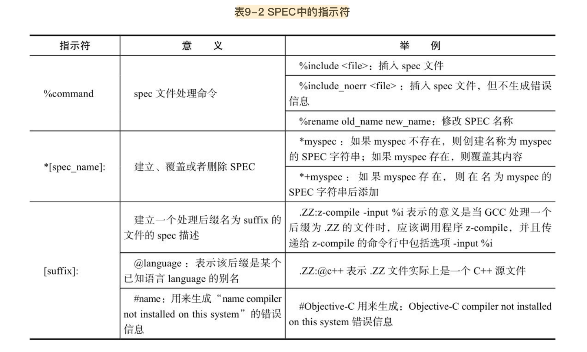
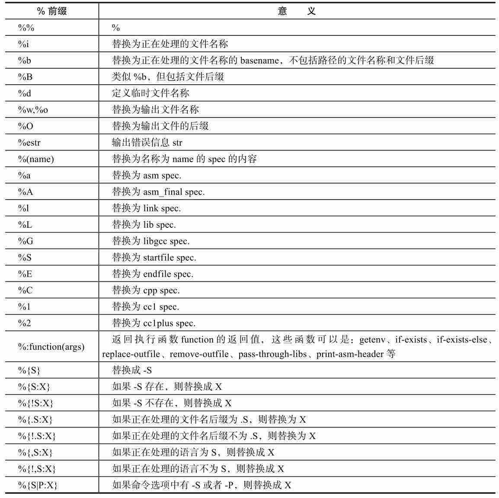

#<center>第九章 机器描述文件target.{ch}</center>
在机器描述文件${target}.md中，使用RTL对目标机器的指令生成进行了详细的描述。然而，对于目标机器来讲，仍然有大量的信息无法使用RTL进行描述，例如寄存器信息、存储布局信息以及一些与硬件相关的函数实现等。因此，这些信息就使用C语言进行描述，其中大部分被设计成宏定义，并包含在${target}.h文件中，而机器描述文件中所使用的一些函数以及一些与目标机器相关的函数则大多在${target}.c文件中定义并实现。

一般来说，${target}.[ch]文件主要包含表9-1所示的与目标机器相关的内容：


##9.1 targetm
struct gcc_target targetm是一个描述目标机器的结构体，定义在target.h文件中。该结构异常复杂，包含了众多的成员变量，囊括了与汇编代码输出、指令调度、向量化、函数参数传递、函数返回以及其他大量与目标机器相关的信息，这些信息大多以函数指针和宏定义的方式给出。

### 9.1.1 struct gcc_target的定义
struct gcc_target在文件gcc/target.h中定义，该结构体非常复杂，包含了目标处理器上汇编代码输出、指令调度、向量化、函数调用中参数传递与函数返回、与C语言或者C++相关的特殊处理、TLS支持、与目标机器相关的选项处理等。这些处理大都以宏定义和函数指针的形式给出，也是机器描述文件${target}.[ch]的主要描述内容。

```cpp
             struct gcc_target{
               /* 与目标机器汇编语言生成相关的定义及函数 */
               struct asm_out{……};
               /* 与指令调度相关的函数定义 */
               struct sched{……};
               /* 与向量化相关的函数定义 */
               struct vectorize{……};
               /* 与机器相关的钩子函数 */
               // ……
               /* 与函数调用、参数传递即函数返回等相关的函数定义 */
               struct calls {……};
               /* 与C语言前端相关的处理函数 */
               struct c {……};
               /* 与C语言前端相关的处理函数 */
               struct cxx {……};
               /*与模拟线程局部存储(Thread Local Storage, TLS)相关的数据定义及函数定义*/
               struct emutls {……};
               /* 与目标机器编译选项处理相关的钩子函数 */
               struct target_option_hooks {……};
               /* 与目标机器相关的一些布尔标志 */
             }

```

下面以该结构体中的struct asm_out为例，对该结构体中的成员变量进行简单的说明。struct asm_out主要定义了与目标系统汇编代码输出相关的常量及函数。

```cpp
               struct asm_out
               {
                 const char *open_paren, *close_paren; /*汇编代码中圆括号的定义，默认值为“(”和“)”*/
                 const char *byte_op; /*字节操作标识，对齐与非对齐的整数操作标识，默认值为“\t.byte\t”*/
                 struct asm_int_op
                 {
                         const char *hi;              /*HImode整数的对齐/非对齐操作符*/
                         const char *si;              /*SImode整数的对齐/非对齐操作符*/
                         const char *di;              /*DImode整数的对齐/非对齐操作符*/
                         const char *ti;              /*TImode整数的对齐/非对齐操作符*/
                  } aligned_op, unaligned_op;
                   
                       /*输出大小为size、对齐方式为aligned_p的rtx x的汇编代码，例如 "\t.byte\t  34"*/
                       bool (* integer) (rtx x, unsigned int size, int aligned_p);
                       /*输出全局的标签，例如".global label_name"*/
                       void (* globalize_label) (FILE *, const char *);
                       /*输出全局声明，例如".global decl_name"*/
                       /* 输出进入函数时的prologue汇编代码 */
                       void (* function_prologue) (FILE *, HOST_WIDE_INT);
                       /* 输出进入函数时prologue之后的汇编代码 */
                       void (* function_end_prologue) (FILE *);
                       /* 输出函数的epilogue代码之前的代码 */
                       void (* function_begin_epilogue) (FILE *);
                       /* 输出函数退出之前的epilogue汇编代码 */
                       void (* function_epilogue) (FILE *, HOST_WIDE_INT);
                       /* 初始化与目标机器相关的section信息 */
                       void (* init_sections) (void);
                       /* 汇编文件开始需要输出的样板文字 */
                       void (*file_start) (void);
                       /* 汇编文件结束需要输出的样板文字 */
                       void (*file_end) (void);
                       /* 省略部分代码 */
                     } asm_out;
```

可以看出，针对某个特定的目标处理器，struct gcc_target targetm结构体的初始化过程为：
* （1）重新定义目标处理器中与默认值不相同的宏定义；
* （2）重新定义宏定义中所引用的函数实现等；
* （3）使用如下形式进行struct gcc_target targetm的初始化。

##9.2 编译驱动及选项

GCC实际上是一个编译驱动程序（Compilation Driver），它通过调用一系列的其他程序来完成编译、汇编以及链接等工作。通常情况下，如图9-1所示，C语言的编译阶段由GCC编译出的cc1程序完成，汇编过程由GNU binutils中的as程序完成，而最终的链接过程一般由GNU binutils中的ld完成。
[插图]图9-1 GCC编译驱动


因此，GCC需要对其命令行参数进行解析，从而根据命令参数判断需要调用哪些程序，以及向这些程序传递什么样的命令行参数。为了完成这些功能，GCC中定义了SPEC字符串，用来描述GCC给这些程序所传递的参数。典型的情况下，对于GCC可以调用的程序，均有一个SPEC字符串与之对应，但也有特殊情况，有些程序可能需要多个SPEC字符串来控制其运行。GCC代码中已经内建了一些SPEC字符串（大多在gcc/gcc.c中定义），用户可以在GCC的命令行使用“-specs=”选项来指定新的SPEC文件，用来覆盖GCC内建的SPEC值，也可以使用-dumpspecs选项来查看GCC使用的SPEC描述信息。


### 9.2.1 编译选项
编译过程中需要众多编译选项的值，一部分可以由用户从命令行输入，也可以通过GCC提供的选项规范（SPEC）文件提供默认的编译选项。SPEC由gcc/gcc.c中定义的SPEC语言（Spec language）来描述，用来生成GCC调用编译、汇编、链接等其他程序时，针对不同后缀的输入文件，应该选用的编译选项及其生成规则。


### 9.2.2 SPEC语言及SPEC文件
可以看出，SPEC文件主要用来定义SPEC语句的生成规则，每个SPEC语句由一个字符串来描述，用户可以使用SPEC文件修改这些SPEC的默认值，也可以在SPEC文件中创建SPEC语句。另外，不同的目标机器大都会定义一些与目标机器相关的SPEC。

SPEC字符串实际上就是需要传递给相应程序的一系列命令行选项及参数。为了方便灵活地进行这些选项的操作，SPEC语言使用以%为前缀的序列对这些SPEC字符串进行操作，例如替换、条件替换等。使用%前缀可以生成非常复杂的命令行选项，表9-3给出了常见的%前缀的使用方法，其他%前缀的用法请参阅SPEC文档。

表9-3 SPEC语言中常见的%前缀

###9.2.3 机器相关的编译选项


