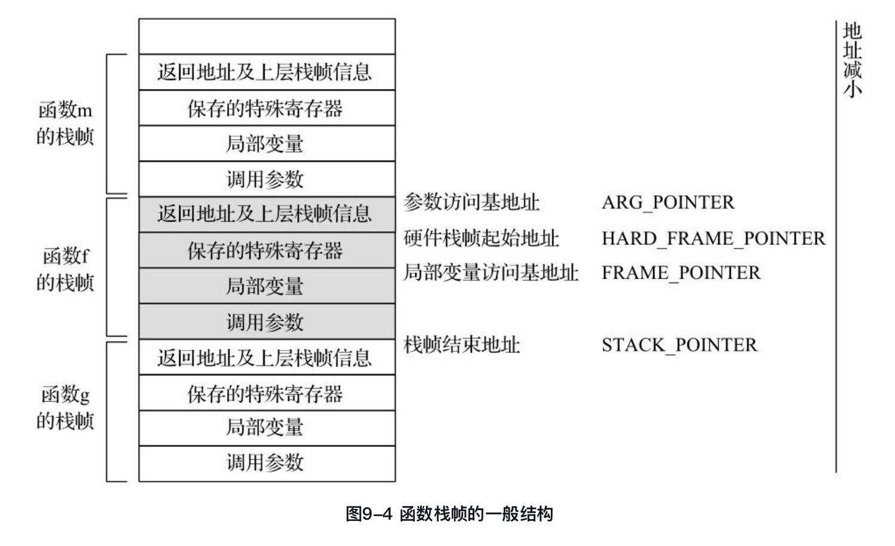
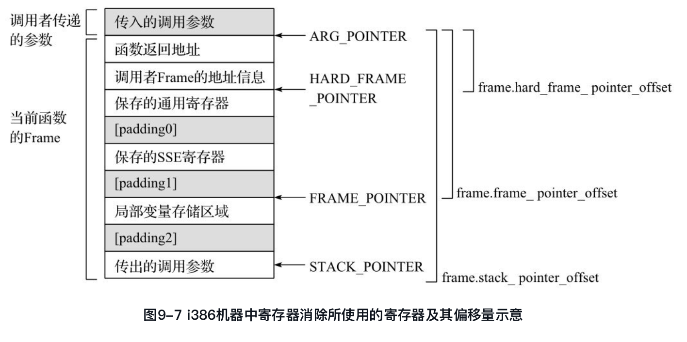
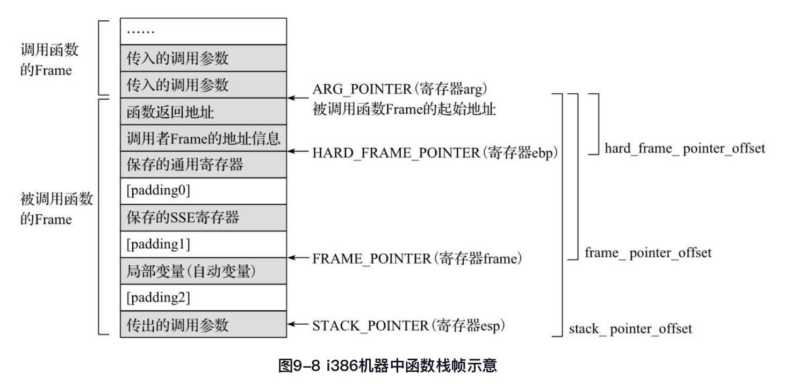
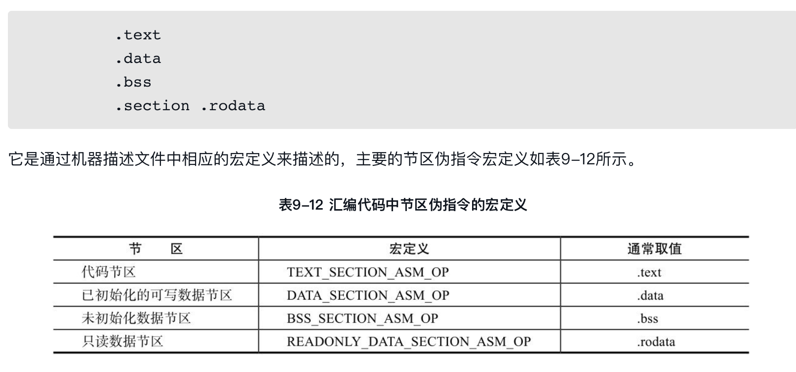
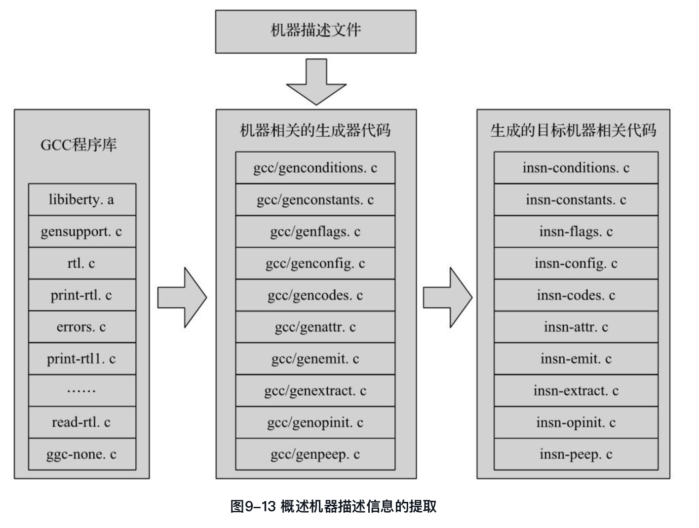
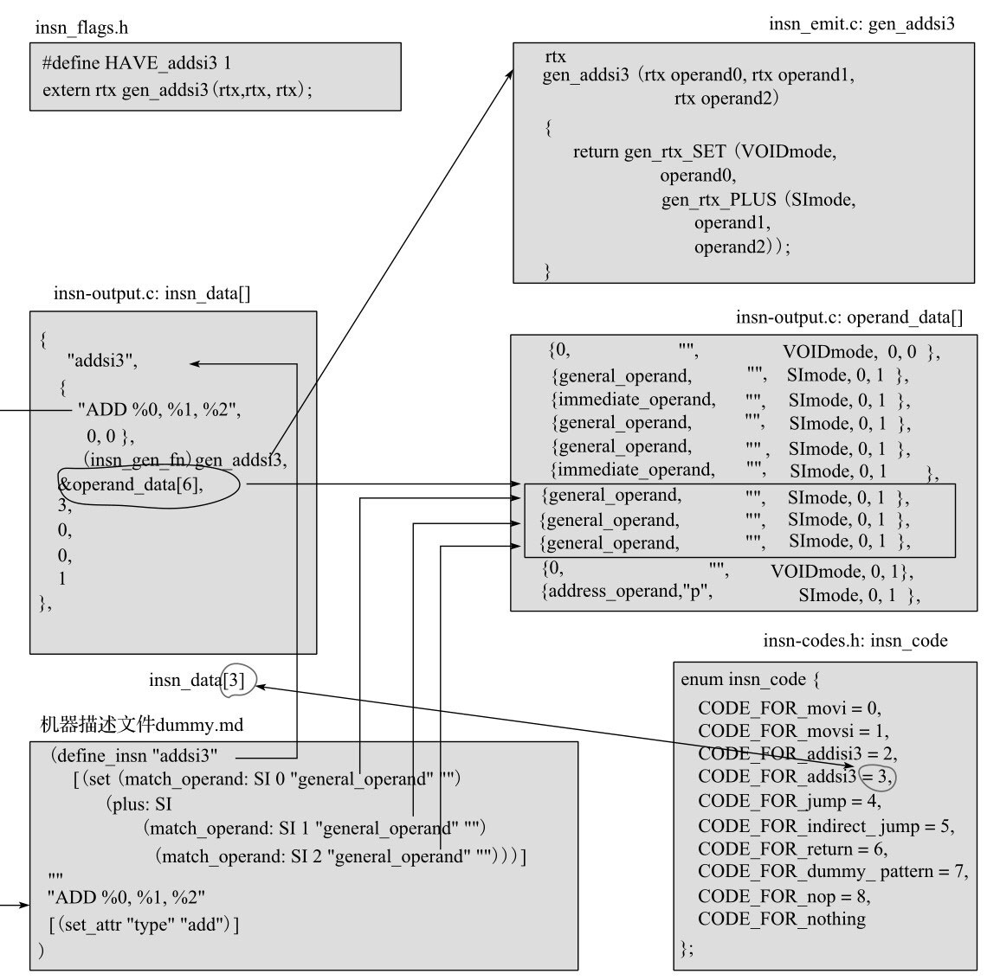

#<center>第九章 机器描述文件target.{ch}</center>
在机器描述文件${target}.md中，使用RTL对目标机器的指令生成进行了详细的描述。然而，对于目标机器来讲，仍然有大量的信息无法使用RTL进行描述，例如寄存器信息、存储布局信息以及一些与硬件相关的函数实现等。因此，这些信息就使用C语言进行描述，其中大部分被设计成宏定义，并包含在${target}.h文件中，而机器描述文件中所使用的一些函数以及一些与目标机器相关的函数则大多在${target}.c文件中定义并实现。

一般来说，${target}.[ch]文件主要包含表9-1所示的与目标机器相关的内容：


##9.1 targetm
struct gcc_target targetm是一个描述目标机器的结构体，定义在target.h文件中。该结构异常复杂，包含了众多的成员变量，囊括了与汇编代码输出、指令调度、向量化、函数参数传递、函数返回以及其他大量与目标机器相关的信息，这些信息大多以函数指针和宏定义的方式给出。

### 9.1.1 struct gcc_target的定义
struct gcc_target在文件gcc/target.h中定义，该结构体非常复杂，包含了目标处理器上汇编代码输出、指令调度、向量化、函数调用中参数传递与函数返回、与C语言或者C++相关的特殊处理、TLS支持、与目标机器相关的选项处理等。这些处理大都以宏定义和函数指针的形式给出，也是机器描述文件${target}.[ch]的主要描述内容。

```cpp
             struct gcc_target{
               /* 与目标机器汇编语言生成相关的定义及函数 */
               struct asm_out{……};
               /* 与指令调度相关的函数定义 */
               struct sched{……};
               /* 与向量化相关的函数定义 */
               struct vectorize{……};
               /* 与机器相关的钩子函数 */
               // ……
               /* 与函数调用、参数传递即函数返回等相关的函数定义 */
               struct calls {……};
               /* 与C语言前端相关的处理函数 */
               struct c {……};
               /* 与C语言前端相关的处理函数 */
               struct cxx {……};
               /*与模拟线程局部存储(Thread Local Storage, TLS)相关的数据定义及函数定义*/
               struct emutls {……};
               /* 与目标机器编译选项处理相关的钩子函数 */
               struct target_option_hooks {……};
               /* 与目标机器相关的一些布尔标志 */
             }

```

下面以该结构体中的struct asm_out为例，对该结构体中的成员变量进行简单的说明。struct asm_out主要定义了与目标系统汇编代码输出相关的常量及函数。

```cpp
               struct asm_out
               {
                 const char *open_paren, *close_paren; /*汇编代码中圆括号的定义，默认值为“(”和“)”*/
                 const char *byte_op; /*字节操作标识，对齐与非对齐的整数操作标识，默认值为“\t.byte\t”*/
                 struct asm_int_op
                 {
                         const char *hi;              /*HImode整数的对齐/非对齐操作符*/
                         const char *si;              /*SImode整数的对齐/非对齐操作符*/
                         const char *di;              /*DImode整数的对齐/非对齐操作符*/
                         const char *ti;              /*TImode整数的对齐/非对齐操作符*/
                  } aligned_op, unaligned_op;
                   
                       /*输出大小为size、对齐方式为aligned_p的rtx x的汇编代码，例如 "\t.byte\t  34"*/
                       bool (* integer) (rtx x, unsigned int size, int aligned_p);
                       /*输出全局的标签，例如".global label_name"*/
                       void (* globalize_label) (FILE *, const char *);
                       /*输出全局声明，例如".global decl_name"*/
                       /* 输出进入函数时的prologue汇编代码 */
                       void (* function_prologue) (FILE *, HOST_WIDE_INT);
                       /* 输出进入函数时prologue之后的汇编代码 */
                       void (* function_end_prologue) (FILE *);
                       /* 输出函数的epilogue代码之前的代码 */
                       void (* function_begin_epilogue) (FILE *);
                       /* 输出函数退出之前的epilogue汇编代码 */
                       void (* function_epilogue) (FILE *, HOST_WIDE_INT);
                       /* 初始化与目标机器相关的section信息 */
                       void (* init_sections) (void);
                       /* 汇编文件开始需要输出的样板文字 */
                       void (*file_start) (void);
                       /* 汇编文件结束需要输出的样板文字 */
                       void (*file_end) (void);
                       /* 省略部分代码 */
                     } asm_out;
```

可以看出，针对某个特定的目标处理器，struct gcc_target targetm结构体的初始化过程为：
* （1）重新定义目标处理器中与默认值不相同的宏定义；
* （2）重新定义宏定义中所引用的函数实现等；
* （3）使用如下形式进行struct gcc_target targetm的初始化。

##9.2 编译驱动及选项

GCC实际上是一个编译驱动程序（Compilation Driver），它通过调用一系列的其他程序来完成编译、汇编以及链接等工作。通常情况下，如图9-1所示，C语言的编译阶段由GCC编译出的cc1程序完成，汇编过程由GNU binutils中的as程序完成，而最终的链接过程一般由GNU binutils中的ld完成。
[插图]图9-1 GCC编译驱动


因此，GCC需要对其命令行参数进行解析，从而根据命令参数判断需要调用哪些程序，以及向这些程序传递什么样的命令行参数。为了完成这些功能，GCC中定义了SPEC字符串，用来描述GCC给这些程序所传递的参数。典型的情况下，对于GCC可以调用的程序，均有一个SPEC字符串与之对应，但也有特殊情况，有些程序可能需要多个SPEC字符串来控制其运行。GCC代码中已经内建了一些SPEC字符串（大多在gcc/gcc.c中定义），用户可以在GCC的命令行使用“-specs=”选项来指定新的SPEC文件，用来覆盖GCC内建的SPEC值，也可以使用-dumpspecs选项来查看GCC使用的SPEC描述信息。


### 9.2.1 编译选项
编译过程中需要众多编译选项的值，一部分可以由用户从命令行输入，也可以通过GCC提供的选项规范（SPEC）文件提供默认的编译选项。SPEC由gcc/gcc.c中定义的SPEC语言（Spec language）来描述，用来生成GCC调用编译、汇编、链接等其他程序时，针对不同后缀的输入文件，应该选用的编译选项及其生成规则。


### 9.2.2 SPEC语言及SPEC文件
可以看出，SPEC文件主要用来定义SPEC语句的生成规则，每个SPEC语句由一个字符串来描述，用户可以使用SPEC文件修改这些SPEC的默认值，也可以在SPEC文件中创建SPEC语句。另外，不同的目标机器大都会定义一些与目标机器相关的SPEC。

SPEC字符串实际上就是需要传递给相应程序的一系列命令行选项及参数。为了方便灵活地进行这些选项的操作，SPEC语言使用以%为前缀的序列对这些SPEC字符串进行操作，例如替换、条件替换等。使用%前缀可以生成非常复杂的命令行选项，表9-3给出了常见的%前缀的使用方法，其他%前缀的用法请参阅SPEC文档。

表9-3 SPEC语言中常见的%前缀

###9.2.3 机器相关的编译选项

##9.3 存储布局
###9.3.1 位顺序和字节顺序
###9.3.2 类型宽度
### 9.3.3 机器模式提升
###9.3.4 存储对齐
###9.3.5 编程语言中数据类型的存储布局

##9.4寄存器使用
本节主要定义了目标机器中的寄存器用法（Register Usage），包括目标机器中物理寄存器的数量、寄存器的初始化、寄存器分配顺序、寄存器在函数调用时是否需要保存、寄存器名称、寄存器类型等。

###9.4.1 寄存器的基本描述
1．物理寄存器数目
2．专用寄存器描述
3．函数调用所使用的寄存器
4．寄存器名称

```cpp
             #define HI_REGISTER_NAMES                                                    \
             {"ax", "dx", "cx", "bx", "si", "di", "bp", "sp",                             \
               "st", "st(1)", "st(2)", "st(3)", "st(4)", "st(5)", "st(6)", "st(7)",       \
               "argp", "flags", "fpsr", "fpcr", "frame",                                  \
               "xmm0", "xmm1", "xmm2", "xmm3", "xmm4", "xmm5", "xmm6", "xmm7",            \
               "mm0", "mm1", "mm2", "mm3", "mm4", "mm5", "mm6", "mm7",                    \
               "r8", "r9", "r10", "r11", "r12", "r13", "r14", "r15",                      \
               "xmm8", "xmm9", "xmm10", "xmm11", "xmm12", "xmm13", "xmm14", "xmm15"}
```
5．寄存器初始信息调整

### 9.4.2 寄存器分配顺序

### 9.4.3 机器模式
在使用寄存器时经常需要描述一个寄存器可以存储何种机器模式的数据，反过来，对于一个特定机器模式的数据来说，需要描述如何获取一个或多个连续的寄存器，用来保存该值。在GCC中，使用数组hard_regno_nregs[][]来表示机器模式与寄存器数目之间的关系，该数目表示了从当前寄存器开始，用多少个连续的寄存器可以存储某种机器模式的数值，该数组在gcc/reginfo.c中定义为：

[插图]该二维数组表示的意义为：对于某个编号为regno的寄存器（0 <= regno < FIRST_PSEUDO_REGISTER），对应于机器模式mode(0 <= mode <= MAX_MACHINE_MODE), hard_regno_nregs[regno][mode]的值就表示从regno寄存器开始，存储机器模式为mode的数据时所需要连续分配的寄存器数目。该数组的初始值由HARG_REGNO_NREGS宏定义给出。

###9.4.4 寄存器类型
例9-22 gcc/config/i386/i386.h中寄存器类型的声明

```cpp
            /* 寄存器类型的枚举值 */
             enum reg_class
             {
                 NO_REGS,
                 AREG, DREG, CREG, BREG, SIREG, DIREG,
                 AD_REGS,                       /*%eax/%edx for DImode*/
                 Q_REGS,                        /*%eax %ebx %ecx %edx*/
                 NON_Q_REGS,                    /*%esi %edi %ebp %esp*/
                 INDEX_REGS,                    /*%eax %ebx %ecx %edx %esi %edi %ebp*/
                 LEGACY_REGS,                   /*%eax %ebx %ecx %edx %esi %edi %ebp %esp*/
                 GENERAL_REGS,                  /*%eax %ebx %ecx %edx %esi %edi %ebp %esp %r8 - %r15*/
                 FP_TOP_REG, FP_SECOND_REG, /*%st(0) %st(1)*/
                 FLOAT_REGS,
                 SSE_FIRST_REG,
                 SSE_REGS,
                 MMX_REGS,
                 FP_TOP_SSE_REGS,
                 FP_SECOND_SSE_REGS,
                 FLOAT_SSE_REGS,
                 FLOAT_INT_REGS,
                 INT_SSE_REGS,
                 FLOAT_INT_SSE_REGS,
                 ALL_REGS, LIM_REG_CLASSES
             };

             /* 寄存器类型总数 */
             #define N_REG_CLASSES ((int) LIM_REG_CLASSES)

             /* 寄存器类型的名称 */
             #define REG_CLASS_NAMES \
             {     "NO_REGS",                                                                                  \
                   "AREG", "DREG", "CREG", "BREG", "SIREG", "DIREG", "AD_REGS",                                \
                   "Q_REGS", "NON_Q_REGS", "INDEX_REGS", "LEGACY_REGS",                                        \
                 "GENERAL_REGS",                                                                            \
                 "FP_TOP_REG", "FP_SECOND_REG", "FLOAT_REGS", "SSE_FIRST_REG", "SSE_REGS", \
                 "MMX_REGS", "FP_TOP_SSE_REGS", "FP_SECOND_SSE_REGS", "FLOAT_SSE_REGS",                     \
                 "FLOAT_INT_REGS", "INT_SSE_REGS", "FLOAT_INT_SSE_REGS",                                    \
                 "ALL_REGS" }

             /* 每一种寄存器类型中所包含的寄存器 */
             #define REG_CLASS_CONTENTS                                                                     \
             {       { 0x00,      0x0 },                    /*NO_REGS*/                                     \
                     { 0x01,      0x0 }, { 0x02, 0x0 }, /*AREG, DREG*/                                      \
                     { 0x04,      0x0 }, { 0x08, 0x0 }, /*CREG, BREG*/                                      \
                     { 0x10,      0x0 }, { 0x20, 0x0 }, /*SIREG, DIREG*/                                    \
                     { 0x03,      0x0 },          /*AD_REGS*/                                               \
                     { 0x0f,      0x0 },          /*Q_REGS*/                                                \
               { 0x1100f0,     0x1fe0 },          /*NON_Q_REGS*/                                            \
                     { 0x7f,   0x1fe0 },          /*INDEX_REGS*/                                            \
               { 0x1100ff,        0x0 },          /*LEGACY_REGS*/                                           \
               { 0x1100ff,     0x1fe0 },          /*GENERAL_REGS*/                                          \
                   { 0x100,       0x0 }, { 0x0200, 0x0 }, /*FP_TOP_REG, FP_SECOND_REG*/                     \
                   { 0xff00,      0x0 },          /*FLOAT_REGS*/                                            \
               { 0x200000,        0x0 },          /*SSE_FIRST_REG*/                                         \
             { 0x1fe00000,0x1fe000 },             /*SSE_REGS*/                                              \
             { 0xe0000000,     0x1f },            /*MMX_REGS*/   
\
             { 0x1fe00100,0x1fe000 },             /*FP_TOP_SSE_REG*/                                        \
             { 0x1fe00200,0x1fe000 },             /*FP_SECOND_SSE_REG*/                                     \
             { 0x1fe0ff00,0x3fe000 },             /*FLOAT_SSE_REGS*/                                        \
                 { 0x1ffff,    0x1fe0 },          /*FLOAT_INT_REGS*/                                        \
             { 0x1fe100ff,0x1fffe0 },             /*INT_SSE_REGS*/                                          \
             { 0x1fe1ffff,0x1fffe0 },             /*FLOAT_INT_SSE_REGS*/                                    \
             { 0xffffffff,0x1fffff }              /*ALL_REGS*/                                              \
             }             
```

##9.5 堆栈及函数调用规范描述

需要说明的是，针对不同的目标机器，由于其指令系统和函数调用规范的不同，栈帧的实现可能是不同的，但其包含的内容基本形同，大多是其组织形式不完全相同。从图9-4可以看出，一个函数的栈帧主要包含了如下的信息：（1）函数返回到调用者的返回地址；（2）函数调用者栈帧的信息，通常是指其栈帧的基地址；（3）函数执行时需要保存的特殊寄存器；（4）函数所使用的局部变量；（5）该函数调用其他函数时的调用参数等

###9.5.1 堆栈的基本特性
例如，在i386机器中，上述4个寄存器arg、esp、ebp及frame编号的定义如下:

```cpp
             /* 参数寄存器编号 */
             #define ARG_POINTER_REGNUM 16
             /* 堆栈指针寄存器编号 */
             #define STACK_POINTER_REGNUM 7
                 /* 硬件栈帧指针寄存器编号 */
                 #define HARD_FRAME_POINTER_REGNUM 6
                 /* 栈帧指针寄存器编号 */
                 #define FRAME_POINTER_REGNUM 20
```

也可以这样理解，virtual_incoming_args_rtx、virtual_stack_vars_rtx、virtual_outgoing_args_rtx均为虚拟寄存器，是分配传入参数、局部变量、传出参数空间的基地址，而stack_pointer_rtx、frame_pointer_rtx、hard_frame_pointer_rtx以及arg_pointer_rtx等均为“物理”寄存器，最终在寄存器分配时，这些虚拟寄存器将根据其与对应“物理”寄存器之间的地址偏移量，表示成对应的“物理”寄存器。这些“物理”寄存器再根据目标机器上寄存器消除的规则进行消除操作（物理寄存器打上引号是因为这些所谓的物理寄存器在目标机器上不一定都存在）。


### 9.5.2 寄存器消除
通常在堆栈中有多个表示堆栈地址的寄存器，例如堆栈寄存器、栈帧寄存器、硬件栈帧寄存器、参数寄存器等。其中堆栈寄存器一般指向当前堆栈的栈顶，硬件栈帧寄存器一般指向执行函数调用的硬件操作后栈帧的栈顶地址，栈帧寄存器一般执行当前栈帧中局部变量存储区域的基地址，参数寄存器则指向堆栈中函数调用参数的基地址。图9-7给出了在i386机器中这几个寄存器的示意图。

这些寄存器之间通常指向同一堆栈的不同位置，彼此之间可以通过地址偏移量进行相互转换。这种使用A寄存器及其与B寄存器地址之间的偏移量来表示B寄存器的过程，就称为寄存器B的消除。使用寄存器消除（RegisterElimination），可以节约硬件寄存器的使用。



###9.5.3 函数栈帧的管理
函数栈帧的创建通常在函数的开始部分（Prologue）进行，需要完成的工作主要包括：（1）函数返回地址的保存：函数返回值的入栈保存操作通常由目标机器的函数调用硬件完成，也可以在Prologue中使用PUSH操作完成，还可以通过MOVE指令完成，具体情况由目标机器的特性所决定。（2）函数调用者的栈帧基地址的保存：函数调用者的栈帧基地址通常使用当前堆栈的栈顶地址表示，根据目标机器的特征，可以使用PUSH指令保存，也可以使用MOVE指令完成。（3）保存函数调用中可能破坏的寄存器：函数调用过程中会使用一些寄存器，如果这些寄存器的值在函数的调用者中需要使用，则需要将这些寄存器的值保存在堆栈中，同样可以使用PUSH指令，也可使用MOVE指令等方式完成。（4）为函数局部变量和传出参数分配空间：该部分空间的分配一般是通过调整栈顶指针完成的。

###9.5.4 参数传递

如果ACCUMULATE_OUTGOING_ARGS宏定义为1，则在函数的开始部分（Prologue）中，根据crtl->outgoing_args_size（即函数传出参数需要的最大空间值）在函数栈帧中通过调整堆栈指针为之分配空间，函数参数将被MOVE指令移入这些空间，完成参数的传递。如果该宏定义为0，则栈帧空间中事先不分配传出参数区域的空间，而是通过PUSH操作完成参数的入栈操作。PUSH_ARGS宏定义就描述了是否使用PUSH操作完成参数的传递。

###9.5.5 函数返回值
###9.5.6 i386机器栈帧

```cpp
             struct ix86_frame
             {
               int padding0;                      /*padding0 的长度*/
               int nsseregs;                      /*可传递参数的SSE寄存器数目*/
               int nregs;                         /*可传递参数的通用寄存器数目*/
               int padding1;                      /*padding1 的长度*/

               int va_arg_size;                   /*可变参数的大小*/
               HOST_WIDE_INT frame;
               int padding2;                      /*padding2的长度*/
               int outgoing_arguments_size;       /*传出参数的大小*/
               int red_zone_size;
               HOST_WIDE_INT to_allocate;
               /* 相对于ARG_POINTER的几个偏移量 */
               HOST_WIDE_INT frame_pointer_offset;
                   HOST_WIDE_INT hard_frame_pointer_offset;
                   HOST_WIDE_INT stack_pointer_offset;
                   bool save_regs_using_mov;
                 };
```

上述结构描述了i386机器中函数栈帧的布局，如图9-8所示，该图中堆栈默认往低地址方向增长，其空间布局主要包括如下内容：


（1）函数返回地址以及函数调用者栈帧的硬件栈帧寄存器（HARD_FRAME_POINTER寄存器，即ebp寄存器）；（2）函数调用中需要保存的寄存器，包括通用寄存器和SSE寄存器等；（3）为局部变量（自动变量）分配的存储空间，通常使用FRAME_POINTER作为其局部变量寻址的基地址；（4）该函数调用其他函数时进行参数传递所需要的空间，通常使用STACK_POINTER作为传出参数寻址的基地址；（5）为了满足堆栈对齐和指针对齐要求而进行的数据填充区域。

##9.6 寻址方式
##9.7 汇编代码分区
GCC编译系统生成的目标机器汇编文件一般由各种不同类型数据的节区（Section）组成。例如，常见的．text节区用来保存指令和只读的数据，.data节区用来存放已初始化的可写数据，.bss节区用来存放未初始化的数据等。因此，在编译的汇编代码生成阶段需要生成相应的节区信息，便于后续汇编器（如GNU as）和链接器（如GNUld）的工作。

Linux系统中目标文件支持多种格式，最常见的为ELF（Executable and Linkable Format）格式，关于ELF文件的格式，尤其是节区的详细文档，可以参考ELF文档及《程序员的自我修养——链接、装载与库》一书的描述。下面的讨论以ELF目标文件为例。


该汇编文件中，指定节区的伪指令（有的文献中也称为伪操作）包括：

##9.8 定义输出的汇编语言

##9.9 机器描述信息的提取
如图9-13所示，GCC源码中包含了一些名称为gcc/gen*的文件，这些文件的功能就是读取、解析机器描述文件，并生成与目标机器相关的源代码。这些以gen开头的文件被称为机器相关的生成器代码（Machine-DependentGenerator Code, MDGC），其编译生成的可执行程序就用来从目标机器的描述文件中提取信息，并生成与目标系统相关的源代码。例如图9-13中的gencodes.c文件将生成可执行程序gencodes, gencodes程序则扫描机器描述文件，分析其中的指令模板，并生成insn-codes.h文件，描述目标机器中所定义的指令模板索引号。


生成的目标机器相关源代码将与GCC的其他源代码一起，编译生成目标机器上的编译器程序。生成的代码一般位于host-\${host}/gcc/目录下，其中\${host}为．/configure时指定的host编译选项的值。

生成的目标机器相关源代码将与GCC的其他源代码一起，编译生成目标机器上的编译器程序。生成的代码一般位于host-\${host}/gcc/目录下，其中\${host}为．/configure时指定的host编译选项的值。

在GCC编译的过程中，通过指定不同的编译目标，即-target选项，MDGC就会选择与目标机器${target}相对应的机器描述文件进行信息提取，并生成一列与目标机器相关的源代码，这些代码的名称以insn-开头，一般位于host-\${host}/gcc目录下。

###9.9.1 gencode.c
gcc/gencodes.c文件从\${target}.md文件中提取define_insn和define_expand所定义的指令模板，并给这些模板编号，对应生成的insn-codes.h就描述了这些指令模板的索引号定义。

```cpp
             /* 该文件由gencodes根据机器描述文件自动生成 */
             #ifndef GCC_INSN_CODES_H
             #define GCC_INSN_CODES_H

             enum insn_code {
               CODE_FOR_movi = 0,
               CODE_FOR_movsi = 1,
               CODE_FOR_addisi3 = 2,
               CODE_FOR_addsi3 = 3,
               CODE_FOR_jump = 4,
               CODE_FOR_indirect_jump = 5,
               CODE_FOR_return = 6,
               CODE_FOR_dummy_pattern = 7,
               CODE_FOR_nop = 8,
               CODE_FOR_nothing
             };

             #endif /*GCC_INSN_CODES_H*/
```

gcc/gencodes.c文件从${target}.md文件中提取define_insn和define_expand所定义的指令模板，并给这些模板编号，对应生成的insn-codes.h就描述了这些指令模板的索引号定义。

###9.9.2 genattr.c
该生成文件从机器描述文件中读取define_atrr的设置，即提取md文件中的属性设置信息，生成insn-attr.h文件，完成机器模板中属性的声明定义。

###9.9.3 genattrtab.c
该文件的主要功能是根据机器描述文件中各个指令模板中属性的值，对于特定的rtx，与指令模板中所定义的RTL模板进行匹配，从而获取匹配指令模板的insn_code，并进一步根据该insn_code的值，返回匹配指令模板中相应的属性取值。

```cpp
             enum attr_type
             get_attr_type (rtx insn ATTRIBUTE_UNUSED)
             {
               switch (recog_memoized (insn))
                 {
                 case 6:   /*return*/
                   return TYPE_RETURN;

                 case 2:   /*addisi3*/
                 case 3:   /*addsi3*/
                   return TYPE_ADD;
                       case 4:   /*jump*/
                       case 5:   /*indirect_jump*/
                         return TYPE_JUMP;

                       case 0:   /*movi*/
                       case 1:   /*movsi*/
                         return TYPE_MOV;

                       case -1:
                         if (GET_CODE (PATTERN (insn)) ! = ASM_INPUT
                             && asm_noperands (PATTERN (insn)) < 0)
                           fatal_insn_not_found (insn);
                       default:
                         return TYPE_OTHER;
                       }
                   }
```

函数get_attr_type的功能就是对于给定的rtx insn，首先通过recog_memoized (insn)函数返回该rtx所匹配的指令模板的insn-code，并返回以insn_code为索引的指令模板中type属性的取值。例如，假设rtx insn与名称为“movi”的指令模板相匹配，那么函数recog_memoized (insn)的返回值将会是enum insn_code中的CODE_FOR_movi取值，即整数0，再根据该insn_code的值，从而返回匹配指令模板中“type”属性的值应该为“TYPE_MOV”。

###9.9.4 genrecog.c
genrecog.c文件的功能是根据md文件，生成代码insn-recog.c。在生成的代码中会引入一个判定树（DecisionTree），即在函数recog()中，根据给定rtx x0的RTX_CODE、机器模式以及操作数类型来查找与rtx x0相匹配的指令模板，如果匹配，则返回该指令模板所对应的insn_code。

###9.9.5 genflag.c
从机器描述文件中读取指令模板信息，生成文件insn-flags.h，其中主要包括指令模板定义的标志以及各个指令模板中构造函数的原型.

### 9.9.6 genemit.c

```
在将GIMPLE转换成RTL时，GCC将根据GIMPLE语句的语义，以及机器描述文件中具有对应语义的（由标准模板名称）指令模板的构造函数，生成对应的rtx，并进一步生成对应的insn。函数genemit.c的功能就是从机器描述文件中生成每个指令模板的构造函数，这些构造函数的名称为gen_\${name}，其中，\${name}代表了机器描述文件中所定义的指令模板的名称，这些构造函数的实现过程被保存在文件insn-emit.c中。
```

###9.9.7 genextract.c
该程序通过对指令模板进行分析，生成insn_extract函数。由于insn是根据指令模板的构造函数生成的，其操作数的信息（包括操作数的数量、机器模式、操作数断言及约束等）也是由指令模板决定的，insn_extract函数的主要功能就是提取insn中的操作数，并将这些操作数保存在recog_data结构中。

###9.9.8 genopinit.c
该程序的功能是根据机器描述文件中所定义的指令模板，初始化optab_table的相关信息。

该结构体主要定义了一组对应操作，即对于RTX_CODE为code，且机器模式为mode（取值为0～NUM_MACHINE_MODES）的RTX在生成insn的过程中，应该使用的指令模板的索引号（该索引号就是insn_code）。对于某个RTX_CODE，每种机器模式可以对应不同的insn_code，这些insn_code就存储在optab.handlers数组中。可以看出，该结构体可以完成一个特定RTX_CODE到指令模板索引号的映射。

###9.9.9 genoutput.c
genoutput.c主要提取机器描述文件中的每个指令模板里所使用的操作数信息及其他信息，生成的代码文件为insn-output.c，

（1）static const struct insn_operand_data operand_data[]：用来保存所有指令模板中的操作数信息，包括机器模式、断言函数指针及约束字符串等信息。
（2）const struct insn_data insn_data[]：以insn_code为索引，每个元素分别保存索引号为insn_code的指令模板中的提取信息，主要包括指令模板名称字符串、构造函数、操作数指针、操作数个数以及该指令模板对应的汇编代码格式字符串等信息。


###9.9.10 genpreds.c
该文件的主要功能是从机器描述文件中提取用户自定义的断言信息，并生成对应的断言函数，其代码保存在文件insn-preds.c中。

###9.9.11 其他
gcc/genpeep.c及gcc/genautomata.c分别用来提取机器描述文件中的窥孔优化信息及自动机信息。另外，机器相关的生成器代码还根据其他的一些描述文件，生成一些目标机器上将要使用的代码。例如，gcc/gengenrtl.c用来对rtl.def进行分析，分别构造创建各种格式的RTX时的构造函数，生成文件genrtl.c及genrtl.h; gcc/genmodes则用来处理系统预定义的机器模式以及目标机器自定义的机器模式，生成insn-modes.c和insn-modes.h等代码。


