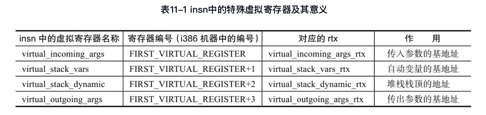
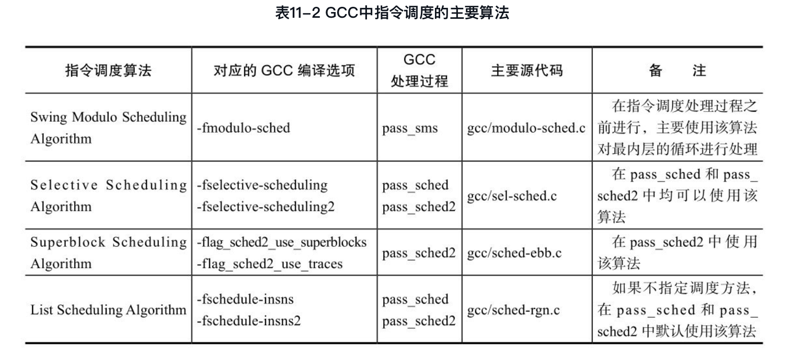

#
第11章 RTL处理及优化

在all_passes链中，执行了pass_expand过程之后，GCC的中间表示就已经转换成RTL形式，此后的所有处理都是基于RTL的处理过程，即RTL_PASS。所有的RTL处理都包含在pass_rest_of_compilation的处理过程及其子过程中，主要包括了对pass_expand所生成的insn序列进行进一步的处理，包括循环优化、指令调度、寄存器分配、窥孔优化等过程，并最终根据RTL生成目标机器上的汇编代码。

##11.1 RTL处理过程
在gcc/passes.c文件中，可以通过增加调试语句，输出各种处理过程的基本信息，其中基于RTL中间表示进行的处理过程主要包括如下的Pass，其中一些主要过程给出了注释说明。

##11.2 特殊虚拟寄存器的实例化
在第10章中介绍的RTL生成过程中，表示函数参数、变量的RTX表示中均使用了一些特殊的虚拟寄存器，例如virtual_incoming_args、virtual_stack_vars、virtual_stack_dynamic以及virtual_outgoing_args等，这些虚拟寄存器是访问函数传入参数、局部变量、堆栈中动态分配空间以及传出参数的基地址，具有非常重要的意义，见表11-1。然而，最终生成代码时，这些虚拟的寄存器需要实例化成目标机器上特定的物理寄存器（硬件寄存器），这正是RTL处理过程pass_instantiate_virtual_regs的主要作用。

##11.3 指令调度
GCC中的指令调度（Instruction Scheduling）就是对当前函数中的insn序列进行重新排序，从而更充分地利用目标机器的硬件资源，提高指令执行的效率。指令调度主要考虑的因素包括数据相关（Data Dependency）、控制相关（Control Dependency）、结构相关（Structural Harzard）、指令延迟（Delay）或者指令代价（Cost）等，通常指令调度与目标机器中的流水线设置紧密相关。

###1．数据相关
###2．控制相关
###3．结构相关

####11.3.1 指令调度算法
GCC中使用的指令调度策略有多种，主要通过GCC命令的编译选项进行选择，表11-2给出了GCC中使用的指令调度编译选项及其对应的调度算法，同时也给出了这些调度算法实现的主要源代码文件。

表调度算法（List Scheduling Algorithm）是最常用的指令调度算法，也是GCC中使用的默认调度算法。表调度算法的基本思想是通过分析指令之间的相关性，包括数据相关性、控制相关性及结构相关性，建立指令之间依赖关系的有向图（Directed Acyclic Graph, DAG），计算指令的优先级（Priority），使用所有依赖性已经满足的指令构造初始化的就绪指令列表，然后重复以下两个步骤直到就绪指令列表中所有的指令被调度完毕。
（1）从就绪指令列表中按照指令的优先级取出一条指令，该指令所有的依赖关系已经满足；
（2）调度该指令，更新与该指令相关的依赖关系，将新的就绪指令插入到就绪指令列表中。

在GCC的表调度算法中，指令调度的范围通常称为一个区域（Region），指令的优先级是指从该指令执行开始，到该区域最后一条指令执行完毕所经历的指令周期数，每条指令的指令周期也称为该指令的指令代价，可使用insn_cost(insn)函数来获取。

###11.3.2 GCC指令调度的实现
基于区域的表调度算法的过程主要包括以下3个阶段的工作：
（1）函数级：主要根据函数的CFG完成区域的计算等；
（2）区域级：主要根据函数的控制流图（CFG）完成基本块之间指令调度属性的计算，还需要根据函数数据流分析的结果完成数据相关性及指令优先级的计算等；
（3）基本块级：对每个基本块中的每一条insn语句，根据其依赖关系、代价、优先级等信息进行重新排序。

###11.3.3 指令调度实例1
本节给出一个在i386 P6机器上进行指令调度的实例，i386 P6机器的流水线包括3个主要的部件：
（1）FETCH/DECODE单元，按序完成取指和译码，其中译码部件有3套，包括decoder0、decoder1和decoder2。
（2）DISPATCH/EXECUTE单元，完成乱序的指令派发和执行，其中包括了5条流水线，分别称为p0、p1、p2、p3和p4。
（3）RETIRE单元，完成指令的按序回收工作。

###11.3.4 指令调度实例2
##11.4 统一寄存器分配
RTL生成和处理过程中使用了大量的虚拟寄存器，这些虚拟寄存器在转换成目标机器汇编代码前，需要映射到目标机器中的物理寄存器上，该过程即为寄存器分配（Register Allocation）。如何合理分配和使用物理寄存器，提高代码质量，是GCC中寄存器分配的主要目标。

GCC 4.4.0中使用的寄存器分配方法称为统一寄存器分配（Integrated Register Allocator, IRA）。统一寄存器分配以区域（Region，通常指循环结构）为寄存器分配的基本单位，基于图染色（Graph Coloring）算法进行寄存器分配，其中图染色算法一般采用Chaitin-Briggs算法。该寄存器分配方法之所以被称为“统一寄存器分配”，是因为在该方法中将寄存器合并（Register Coalescing）、寄存器生存范围划分（Register Live Range Splitting）、寄存器优选（Register Preference）、产生代码等过程与寄存器分配中的染色（Coloring）过程整合在一起。

###11.4.1 基本术语
1．区域
2．覆盖类型
3．分配元
4．Cap分配元
5．Copy关系
6．Spill操作
7．分配代价
8．生存范围

###11.4.2 寄存器分配的主要流程
####0．初始化
####1．建立IRA的中间表示（Build IR）
该过程的入口函数为gcc/ira-build.c中的ira-build()函数，主要完成的功能包括：（1）建立区域，主要由gcc/ira-build.c中的form_loop_tree()函数完成。（2）创建并初始化分配元，主要由ira-build.c中的create_allocnos()函数完成。（3）查找每个分配元的覆盖类型，并计算该分配元使用内存和覆盖类型中每个硬件寄存器的代价，主要由ira-cost.c中的ira_costs()函数完成。（4）计算每个分配元的生存范围，计算每个区域覆盖类型中每个寄存器的使用强度（Register Pressure），建立每个分配元的冲突信息等，主要由ira-lives.c中的ira_create_allocno_live_ranges()函数和gcc/ira-conflicts.c中的build_conflicts()函数完成。（5）删除寄存器强度较低的区域，用来加速IRA过程，主要由ira-build.c中的remove_unnecessary_regions()函数完成。（6）将内层区域中收集到的分配元信息传递到外层区域，主要由ira-build.c中的propagate_allocno_info()函数完成。（7）创建Caps分配元，主要由ira-build.c中的create_caps()函数完成。（8）在收集到所有分配元的生存范围和覆盖类型信息之后，计算同一寄存器类型中冲突的分配元，主要由ira-conflicts.c中的ira_build_conflicts()函数完成。

####2．寄存器着色（Coloring）
按照自顶向下的顺序，遍历每个区域，对于每个区域中的分配元进行着色处理，主要由ira-color.c中的ira_color()函数完成，根据编译选项是否进行优化，可以进行两种方法的寄存器分配：（1）编译时使用-O1、-O2等优化选项，则选择color()函数完成基于Chaitin-Briggs算法的区域寄存器分配。（2）编译时使用-O0选项，或者不使用-O选项，则选择fast_allocation()函数，仅根据分配元的生存范围，按照Chow优先级着色算法（Chow's Priority Coloring Algorithm）进行寄存器分配。如果一个分配元无法分配到一个物理寄存器，或者当其使用内存的代价比使用寄存器更小时，IRA将对该分配元执行Spill操作，即不为其分配物理寄存器。

#### 3．Spill/Restore 代码移动（Code Moving）
####4．代码修改（Code Change）
####5．IRA内部表示扁平化（Flattening Internal Representation）
####6．对所有执行Spill操作的分配元尝试分配物理寄存器（Assign Hard Registers to All Spilled Allocnos）
####7．Reload pass

Reload过程是GCC中一个异常复杂的过程，而且与寄存器分配、机器描述文件等内容交织在一起，非常难以理解，主要完成的功能包括：（1）Spill代码生成（Spill Code Generation）：寄存器分配时，由于虚拟寄存器之间的冲突和物理寄存器的数量限制，部分虚拟寄存器可能分配不到物理寄存器，此时需要使用堆栈存储空间进行该虚拟寄存器数据的保存和恢复，从而需要生成部分新的代码。在有些情况下，生成新代码的过程中还会产生新的虚拟寄存器操作数，此时还需要进一步调用寄存器着色，重新进行寄存器的分配。（2）指令insn中操作数约束的有效性验证（Instruction/Register Constraint Validation）。（3）寄存器消除。也可以这样来看待Reload过程的作用：将非严格的RTL（Non-strict RTL）转换成严格的RTL（Strict RTL）。所谓严格的RTL，是指表示函数指令的每一条insn都能与机器描述文件中的某个指令模板相匹配，指令的操作数（可以是寄存器、内存引用或立即数等）均可使用目标机器语言进行描述，即满足目标机器中操作数的约束要求。所谓非严格的RTL，则是指目标机器可以使用汇编指令完成的一些操作，但其操作数不一定满足目标机器中操作数的要求。

由于Reload过程会对指令中操作数的约束条件进行验证，从中选择可以满足要求的操作数形式，在此过程中，可能会对操作数进行一些处理，从而形成新的代码，而这些新产生的代码可能会产生新的虚拟寄存器，导致新的寄存器分配过程，同时新产生的代码也会出现操作数不满足目标机器约束要求的情况，因此在GCC 4.4.0版本中，IRA和Reload过程交织在一起，互相引用，关系比较混乱。

###11.4.3 代码分析
###11.4.4 寄存器分配实例1
0．初始化，主要包括数据流分析、设置寄存器使用的基本信息等
1．建立寄存分配中的中间表示
2．寄存器着色
3．Spill/Restore代码移动本例中，由于子区域Loop1中寄存器使用强度较弱，所以该区域在ira_build中已经由remove_unnecessary_regions()函数移除了。因此，本例中只有根区域Loop0，不存在区域边界上的Spill/Restore代码，也不需要移动。
4．代码修改与上述第3点中的原因相同，本例中只有根区域Loop0，并且不存在标记为Spilled的分配元，因此，不需要进行代码修改的操作。
5．IRA内部表示扁平化IRA对所有的内部表示进行变形，将所有区域中的分配元表示合并到一个区域中，主要在ira-build.c中实现。
6．对所有执行Spill操作的分配元尝试分配物理寄存器与上述原因相同，本例中不存在标记为Spilled的分配元，因此，不需要进行本阶段的处理。
7．Reload pass
###11.4.5 寄存器分配实例2

##11.5 汇编代码生成
###11.5.1 汇编代码文件的结构
另外，在rest_of_handle_final函数中还有5个函数，分别生成汇编代码中的部分内容。这几个函数都是以函数为单位，生成其汇编文件中的部分内容。（1）assemble_start_function()：主要完成代码中节区（Section）的设置，声明函数名称符号及其类型、设置函数名称符号等。（2）final_start_function()：主要调用宏定义TARGET_ASM_FUNCTION_PROLOGUE，生成该函数汇编代码的开始部分。（3）final()：该函数用于处理函数所对应的insn列表，逐一生成对应的汇编代码。final函数在处理insn NOTE时，如果NOTE的类型为NOTE_INSN_PROLOGUE_END，将会调用宏定义TARGET_ASM_FUNCTION_END_PROLOGUE对应的函数，到此为止，函数PROLOGUE部分全部结束；如果NOTE的类型为NOTE_INSN_EPILOGUE_BEG，将会调用宏定义TARGET_ASM_FUNCTION_ BEGIN_EPILOGUE所定义的函数，从此处开始为函数的EPILOGUE部分。（4）final_end_function()：主要调用宏定义TARGET_ASM_FUNCTION_EPILOGUE，生成该函数汇编代码的结束部分。（5）assemble_end_function()：主要在函数代码结束时，输出当前函数的size属性。

###11.5.2 从RTL到汇编代码
final_scan_insn函数对每一条insn进行逐个处理：（1）如果当前insn为NOTE，则根据NOTE的类型，分别进行不同的处理，主要是调用debug_hooks中的一些函数，生成调试信息，另外当NOTE的类型为NOTE_INSN_PROLOGUE_END时，将会调用宏定义TARGET_ASM_FUNCTION_END_PROLOGUE对应的函数；如果NOTE的类型为NOTE_INSN_EPILOGUE_BEG，将会调用宏定义TARGET_ASM_FUNCTION_ BEGIN_EPILOGUE所定义的函数。（2）如果当前insn为BARRIER，一般只生成对应的调试信息，并不生成对应的汇编指令代码。（3）如果当前insn为CODE_LABEL，则生成对应的调试信息，并生成汇编代码中的标签符号信息。（4）如果当前insn为INSN、JUMP_INSN或CALL_INSN，一般的处理流程是：首先通过函数recog_memoized()查找该insn对应的机器模板的索引号，即insn_code_number，然后函数get_insn_template()根据insn_code获取该insn对应的指令输出模板templ，最后函数output_asm_insn(templ, recog_data.operand)根据指令输出模板生成该指令所对应的汇编代码，该过程参见图9-15。

