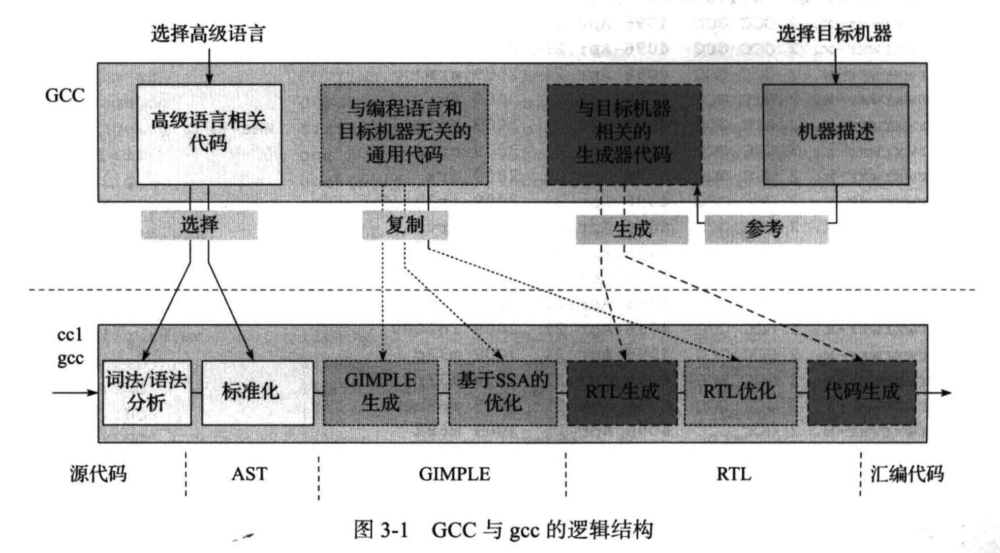

#第三章 GCC总体结构
##3.1.GCC的目录结构
**gcc_4.4代码架构**
1.1 与GCC编译配置有关的config*文件
1.2 lib*目录：各种各样的库文件，既包括一些通用的库文件，也包含一些与语言相关的库文件，例如libcpp中包含与C++语言相关的代码库文件，libada中包含与ADA语言相关的代码库文件。
1.3 gcc目录中包含GCC的核心代码，包括了与各种编程语言相关的词法、语法等前端分析程序，与各种目标机器相关的机器描述文件，以及与前端语言无关而且与后端机器无关的核心处理代码等。

##3.2 GCC的逻辑结构

###（一）图的上半部分根据源代码的功能将GCC源码分为4大部分：
* （1）高级语言相关代码。对于GCC能够编译的每一种编程语言都有其相应的处理代码，这些代码主要集中在\${GCC\_SOURCE}/\${Language}目录下。其中\${Language}代码了编程语言的名称，这部分代码主要为了完成高级编程语言的词法、语法分析等功能，从而生成该语言对应的抽象语法树（AST），并完成其规范化操作（Genericize）。
* （2）与编程语言和目标机器无关的通用代码。这部分主要包括\${GCC\_SOURCE}/目录下的代码，用于完成GIMPLE和RTL的生成，以及数量庞大的基于GIMPLE和RTL的处理及编译优化工作。
* （3）机器描述代码。对于GCC支持的每一种名称为\${target}的目标机器，在GCC的代码中均有一个名称为\${GCC\_SOURCE}/config/\${target}的子目录，用来存放与该目标机器相关的机器描述代码及其相应的头文件和c文件等。
* （4）与目标机器相关的生成器代码。这部分代码比较难以理解，读者可以试着这样来考虑。为了生成目标机器上编译器程序cc1, GCC提供的源代码在设计阶段是不完整的，其中缺少的部分主要包括目标机器相关的RTL构造及目标代码生成等部分的源代码。由于这一部分源代码是与目标机器相关的，在GCC设计源代码时是难以确定的，因此，GCC采用了这样一种解决的思路，就是通过一些生成器（Generator）代码，这些代码能够根据目标机器的机器描述文件，提取目标机器的信息，从而自动地生成关于目标机器上RTL构造及目标代码生成的源代码，并将这些源代码与GCC原有的其他代码结合在一起编译，从而生成与目标机器相关的编译器程序。与目标机器相关的生成器代码的文件名称一般为\${GCC_SOURCE}/gen*.[ch]，其主要的功能就是根据机器描述文件生成与目标机器相关的部分源代码。

###（二）下半部分给出了根据上述GCC的源代码所生成的目标机器上编译器cc1（gcc程序所调用的编译器）的主要工作流程。
从整体上看，目标机器上编译器cc1的功能就是将用户输入的高级程序代码最终编译成目标机器上的汇编代码，其中经历了
* 前端的词法分析、语法分析、语义分析，
* 中间的GIMPLE生成、GIMPLE优化，
* 以及后端的RTL生成、RTL优化、代码生成等几个步骤。

在这些处理过程中，GCC也分别使用几种不同的中间表示（Intermediate Representation,IR）形式，包括AST、GIMPLE、RTL等。

这些处理步骤与上半部分的代码具有一定的对应关系，
* 例如词法、语法分析以及AST的规范化过程对应上半部分的“高级语言相关代码”; 
* GIMPLE生成、GIMPLE优化及RTL优化部分则对应上半部分的“与编程语言和目标机器无关的代码”;
* RTL生成以及最终的汇编代码生成部分则由上半部分的“与目标机器相关的生成器代码”根据上半部分的“机器描述”生成。
