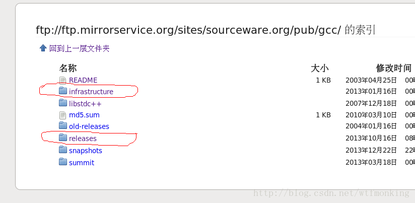

#1.downloads
##1.1.ftp 
ftp://ftp.mirrorservice.org/sites/sourceware.org/pub/gcc

##1.2 github
https://github.com/gcc-mirror/gcc

##1.3 wget
wget -c http://mirror1.baby1on.network/gcc/releases/gcc-4.4.0/gcc-4.4.0.tar.bz2

##1.4 gcc4.4.6源码下载
https://ftp.gnu.org/gnu/gcc/gcc-4.4.6/

##1.5 已有安装的版本是gcc82
/home/opt/compiler/gcc-8.2/bin/gcc

#2.依赖


因为缺少gcc依赖的gmp、mpfr、mpc三个软件，所以需要下载安装他们，他们在上面的
 infrastructure 文件夹内可以找到。同时gmp与mpfr及mpc之间还有相互依赖关系，所以
 要按下面顺序安装，并在 configure后面的选项后面带上所依赖软件的路径
 
#3.安装及错误解决

```bash
（1）、解压gcc
$tar -zxvf gcc-4.4.6.tar.gz
 
（2）、解压安装gmp
$tar -jxvf gmp-4.3.2.tar.bz2
$cd gmp-4.3.2
$./configure --prefix=/home/chenhui2/bin/gmp-4.3.2 //gmp安装路径
$make
$make check//会有一个case通不过，不过没事，不理会。
$sudo make install
 
（3）、解压安装mpfr
$tar -jxvf mpfr-2.4.2.tar.bz2
$cd mpfr-2.4.2
//congfigure后面是mpfr安装路径及依赖的gmp路径
$./configure --prefix=/home/chenhui2/bin/mpfr-2.4.2 --with-gmp=/home/chenhui2/bin/gmp-4.3.2
$make
$make check
$sudo make install
 
（4）、解压安装mpc
$tar -zxvf mpc-0.8.1.tar.gz
$cd mpc-0.8.1
//congfigure后面是mpc安装路径及依赖的gmp和mpfr路径
$./configure --prefix=/home/chenhui2/bin/mpc-0.8.1 --with-gmp=/home/chenhui2/bin/gmp-4.3.2 --with-mpfr=/home/chenhui2/bin/mpfr-2.4.2
$make
$make check
$sudo make install
 
 
若没有下面的配置，则会出现如下的mpc库错误及其他库错误等等，所以需要进行一系列配置
 
//================================出现错误======================================
gcc error while loading shared libraries: libmpc.so.2:
cannot open shared object file:No such file or directory
//===============================================================================
 
（5）、配置库路径
 
#vi /etc/profile  //向/etc/profile文件末尾添加下面的语句（root权限下）：
 
export LD_LIBRARY_PATH=$LD_LIBRARY_PATH:/home/chenhui2/bin/gmp-4.3.2/lib:
/home/chenhui2/bin/mpfr-2.4.2/lib:/home/chenhui2/bin/mpc-0.8.1/lib
 
 
 //下面的流程可忽略
#vi /etc/ld.so.conf //编辑这个文件，添加下面路径
 
/usr/local/mpc-0.8.1/lib
/usr/local/gmp-4.3.2/lib
/usr/local/mpfr-2.4.2/lib
 
$sudo ldconfig
 
 
 
（6）、安装gcc
$./configure --prefix=/home/chenhui2/bin/gcc446 --with-gmp=/home/chenhui2/bin/gmp-4.3.2 --with-mpfr=/home/chenhui2/bin/mpfr-2.4.2 --with-mpc=/home/chenhui2/bin/mpc-0.8.1 --enable-language=c,c++
 
$make
$sudo make install
（7）问题：stubs-32.h
/usr/include/gnu/stubs.h:7:27: fatal error: gnu/stubs-32.h: No such file or directory
###缺少头文件， yum provides命令查询哪个组件可以提供头文件

[root@localhost test]# yum provides */stubs-32.h
Loaded plugins: fastestmirror, langpacks
Loading mirror speeds from cached hostfile
 * base: mirrors.aliyun.com
 * extras: mirrors.aliyun.com
 * updates: mirrors.163.com
glibc-devel-2.17-292.el7.i686 : Object files for development using standard C
                              : libraries.
Repo        : base
Matched from:
Filename    : /usr/include/gnu/stubs-32.h


[root@localhost test]# yum install -y glibc-devel-2.17-292.el7.i686

（8）问题：CentOS 6.5下安装gcc-4.8.4 make的时候提示以下错误：
configure: error: cannot compute suffix of object files: cannot compile

解决办法：
export LD_LIBRARY_PATH=$LD_LIBRARY_PATH:/opt/gcc-4.6.3/mpc-0.9/mpc_install/lib:/opt/gcc-4.6.3/gmp-5.0.4/gmp_install/lib:/opt/gcc-4.6.3/mpfr-3.1.0/mpfr_install/lib

（9）问题：error: redefinition of ‘exact_log2’
修改Makefile
CC = gcc -fgnu89-inline
CXX = g++ -fgnu89-inline

修改configure参数也可以
CFLAGS='-fgnu89-inline -g -O2' CXXFLAGS='-fgnu89-inline -g -O2'

``` 
 